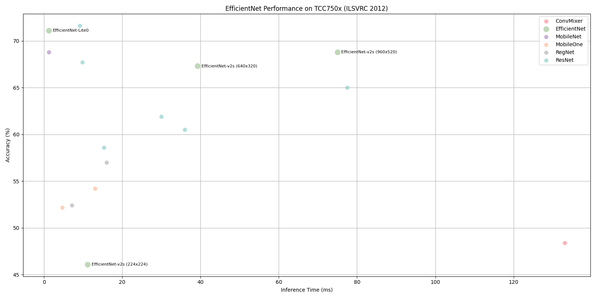

# EfficientNet Benchmark on TCC750x

The following table shows benchmark results for the EfficientNet-Lite0 and EfficientNet-v2s models running on the TCC750x NPU.  
EfficientNet is a family of lightweight and efficient convolutional neural networks optimized for image classification tasks, particularly on embedded and mobile devices. 

All models are evaluated using the ILSVRC 2012 (ImageNet) validation dataset and compiled with the tc-nn-toolkit toolkit.  
Click on the model name to download a tar file containing the model binary for TCC750x.

---

### 📊 Table Overview

| Column                    | Description                                                                 |
|--------------------------|-----------------------------------------------------------------------------|
| **Model**                | Name of the neural network model     |
| **Framework**            | Deep learning framework used (e.g., PyTorch\*, TFLite, ONNX)                  |
| **Dataset**              | Dataset used to benchmark model performance (e.g., ILSVRC 2012 (ImageNet) validation set with 50,000 images)  |
| **Input Size (WxHxC)**   | Input Size (Width × Height × Channels) of the input image required by the model                            |
| **Inference Time (ms)**  | Inference time measured on the TCC750x EVB using zero-padded input images                |
| **Accuracy**             | Top-1 classification accuracy on the ILSVRC 2012 (ImageNet) validation dataset (50,000 images)                    |
| **Quantization Bit**     | Bit-depth used for quantization (e.g., INT8)                                |
| **Compiled Model Files**   | Sizes of the compiled model components: Weight and Bias Binary (.bin) and Command Binary (.bin) for execution on TCC750x                    |
| **References**           | Link to the original repository of the model      

- - -

<table border="1" cellspacing="0" cellpadding="5">
    <thead>
        <tr>
            <th rowspan="2" colspan="2">Model</th>
            <th rowspan="2">Framework</th>
            <th rowspan="2">Dataset</th>
            <th rowspan="2">Input Size (WxHxC)</th>
            <th rowspan="2">Inference Time (ms)</th>
            <th colspan="2">Accuracy</th>
            <th rowspan="2">Quantization Bit</th>
            <th colspan="2">Compiled Model Files</th>
            <th rowspan="2">References</th>
        </tr>
        <tr>
            <th>FP32</th>
            <th>INT8</th>
            <th>Weight and Bias Binary Size (MB)</th>
            <th>Command Binary Size (KB)</th>
        </tr>
    </thead>
    <tbody>
        <tr>
            <td align="center" colspan="1">EfficientNet</td>
            <td align="center" rowspan="1" class="variant"><a href="efficientnet_lite0/">Lite0</a></td>
            <td align="center">PyTorch</td>
            <td align="center">ILSVRC 2012</td>
            <td align="center">224x224x3</td>
            <td align="center">1.26</td>
            <td align="center">0.714</td>
            <td align="center">0.711</td>
            <td align="center">INT8 </td>
            <td align="center">4.67</td>
            <td align="center">22</td>
            <td align="center"><a href="https://huggingface.co/timm/efficientnet_lite0.ra_in1k">Hugging Face</a></td>
        </tr>
        <tr>
            <td align="center" colspan="1" rowspan="3">EfficientNet-v2</td>
            <td align="center" rowspan="3" class="variant"><a href="efficientnet_v2s/">s</a></td>
            <td align="center">PyTorch</td>
            <td align="center">ILSVRC 2012</td>
            <td align="center">224x224x3</td>
            <td align="center">11.15</td>
            <td align="center">0.782</td>
            <td align="center">0.461</td>
            <td align="center">INT8 </td>
            <td align="center">21.54</td>
            <td align="center">364</td>
            <td align="center" rowspan="3" class="variant"><a href="https://docs.pytorch.org/vision/main/models/generated/torchvision.models.efficientnet_v2_s.html#torchvision.models.EfficientNet_V2_S_Weights">PyTorch</a></td>
        </tr>
        <tr>
            <td align="center">PyTorch</td>
            <td align="center">ILSVRC 2012</td>
            <td align="center">640x320x3</td>
            <td align="center">39.25</td>
            <td align="center">0.695</td>
            <td align="center">0.673</td>
            <td align="center">INT8 </td>
            <td align="center">21.04</td>
            <td align="center">445</td>
        </tr>
        <tr>
            <td align="center">PyTorch</td>
            <td align="center">ILSVRC 2012</td>
            <td align="center">960x520x3</td>
            <td align="center">74.96</td>
            <td align="center">0.724</td>
            <td align="center">0.688</td>
            <td align="center">INT8 </td>
            <td align="center">21.04</td>
            <td align="center">753</td>
        </tr>
    </tbody>
</table>

- - -

## 📤 Output Format

- The model returns the index of the top-1 class with the highest confidence score among the 1,000 ImageNet classes.

- - -

### Footnote                
* PyTorch* models are converted to ONNX for deployment.
