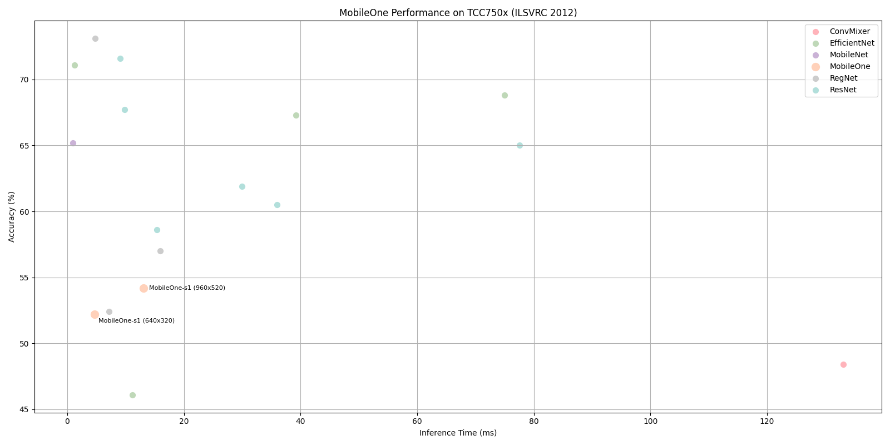

# MobileOne Benchmark on TCC750x

The following table shows benchmark results for the MobileOne-s1 model running on the TCC750x NPU.
MobileOne is a family of lightweight and efficient convolutional neural networks optimized for image classification tasks, particularly on embedded and mobile devices.

The MobileOne-s1 model is evaluated using the ILSRVC 2012 (ImageNet) validation dataset and compiled with the tc-nn-toolkit toolkit.
Click on the model name to download a tar file containing the model binary for TCC750x.

---

### 📊 Table Overview

| Column                    | Description                                                                 |
|--------------------------|-----------------------------------------------------------------------------|
| **Model**                | Name of the neural network model     |
| **Framework**            | Deep learning framework used (e.g., PyTorch\*, TFLite, ONNX)                  |
| **Dataset**              | Dataset used to benchmark model performance (e.g., ILSVRC 2012 (ImageNet) validation set with 50,000 images)  |
| **Input Size (WxHxC)**   | Input Size (Width × Height × Channels) of the input image required by the model                            |
| **Inference Time (ms)**  | Inference time measured on the TCC750x EVB using zero-padded input images                |
| **Accuracy**             | Top-1 classification accuracy on the ILSVRC 2012 (ImageNet) validation dataset (50,000 images)                   |
| **Quantization Bit**     | Bit-depth used for quantization (e.g., INT8)                                |
| **Compiled Model Files**   | Sizes of the compiled model components: Weight and Bias Binary (.bin) and Command Binary (.bin) for execution on TCC750x                    |
| **References**           | Link and license\** information for the original repository of the model

- - -

<table border="1" cellspacing="0" cellpadding="5">
    <thead>
        <tr>
            <th rowspan="2" colspan="2">Model</th>
            <th rowspan="2">Framework</th>
            <th rowspan="2">Dataset</th>
            <th rowspan="2">Input Size (WxHxC)</th>
            <th rowspan="2">Inference Time (ms)</th>
            <th colspan="2">Accuracy</th>
            <th rowspan="2">Quantization Bit</th>
            <th colspan="2">Compiled Model Files</th>
            <th colspan="2">References</th>
        </tr>
        <tr>
            <th>FP32</th>
            <th>INT8</th>
            <th>Weight and Bias Binary Size (MB)</th>
            <th>Command Binary Size (KB)</th>
            <th>Link</th>
            <th>License</th>
        </tr>
    </thead>
    <tbody>
        <tr>
            <td align="center" rowspan="2" colspan="">MobileOne</td>
            <td align="center" rowspan="2" class="variant"><a href="mobileone_s1/">s1</a></td>
            <td align="center">PyTorch</td>
            <td align="center">ILSVRC 2012</td>
            <td align="center">640x320x3</td>
            <td align="center">4.7</td>
            <td align="center">0.556</td>
            <td align="center">0.522</td>
            <td align="center">INT8 </td>
            <td align="center">4.61</td>
            <td align="center">134</td>>
            <td align="center" rowspan="2"><a href="https://huggingface.co/timm/mobileone_s1.apple_in1k">Hugging Face</a></td>
            <td align="center" rowspan="2">Apple</td>
        </tr>
        <tr>
            <td align="center">PyTorch</td>
            <td align="center">ILSVRC 2012</td>
            <td align="center">960x520x3</td>
            <td align="center">13.04</td>
            <td align="center">0.575</td>
            <td align="center">0.542</td>
            <td align="center">INT8 </td>
            <td align="center">4.61</td>
            <td align="center">134</td>
        </tr>
    </tbody>
</table>

- - -

## 📤 Output Format

- The model's raw output consists of logit values corresponding to all 1000 ImageNet claasses.
- These outputs can be post-processed using softmax or argmax as needed.

- - -

### Footnote
* PyTorch* models are converted to ONNX for deployment.

* License\**:
  - Telechips Inc. is not responsible for any issues, damages, or losses resulting from the use of code downloaded from GitHub repositories provided by Telechips.
  - The performance results of neural networks (such as, mAP or inference time) are not subject to license term and may be used freely.
  - Any output generated by software execution may or may not be subject to license terms, depending on the contract and intended use of the output.

