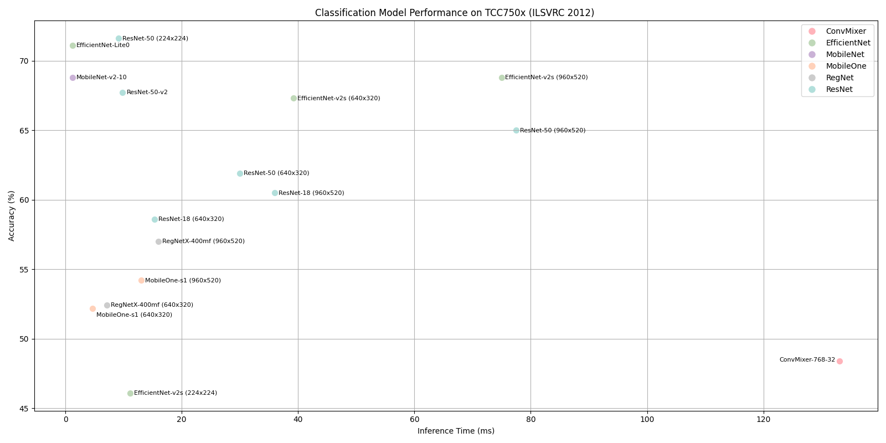

# Classification Benchmark on TCC750x
The following table shows benchmark results for various classification models running on the TCC750x NPU.  
You can compare the performance of each model. 

Click on the model name to download a tar file containing the model binary for TCC750x.

- - -

### 📊 Table Overview

| Column                    | Description                                                                 |
|--------------------------|-----------------------------------------------------------------------------|
| **Model**                | Name of the neural network model     |
| **Framework**            | Deep learning framework used (e.g., PyTorch\*, TFLite, ONNX)                  |
| **Dataset**              | Dataset used to benchmark model performance  |
| **Input Size (WxHxC)**   | Input Size (Width × Height × Channels) of the input image required by the model                            |
| **Inference Time (ms)**  | Inference time measured on the TCC750x EVB using zero-padded input images                |
| **Accuracy**             | Top-1 classification accuracy on the validation dataset                     |
| **Quantization Bit**     | Bit-depth used for quantization (e.g., INT8)                                |
| **Compiled Model Files**   | Sizes of the compiled model components: Weight and Bias Binary (.bin) and Command Binary (.bin) for execution on TCC750x                    |
| **References**           | Link to the original repository of the model      

- - -

<table border="1" cellspacing="0" cellpadding="5">
    <thead>
    <tr>
        <th rowspan="2" colspan="2">Model</th>
        <th rowspan="2">Framework</th>
        <th rowspan="2">Dataset</th>
        <th rowspan="2">Input Size (WxHxC)</th>
        <th rowspan="2">Inference Time (ms)</th>
        <th colspan="2">Accuracy</th>
        <th rowspan="2">Quantization Bit</th>
        <th colspan="2">Compiled Model Files</th>
        <th rowspan="2">References</th>
    </tr>
    <tr>
        <th>FP32</th>
        <th>INT8</th>
        <th>Weight and Bias Binary Size (MB)</th>
        <th>Command Binary Size (KB)</th>
    </tr>
    </thead>
    <tbody>
        <tr>
            <td align="center" colspan="1"><a href="ConvMixer/README.md">ConvMixer</a></td>
            <td align="center" rowspan="1" class="variant"><a href="ConvMixer/convmixer_768_32/">768-32</a></td>
            <td align="center">PyTorch </td>
            <td align="center">ILSVRC 2012</td>
            <td align="center">224x224x3</td>
            <td align="center">133.05</td>
            <td align="center">0.531</td>
            <td align="center">0.484</td>
            <td align="center">INT8 </td>
            <td align="center">21</td>
            <td align="center">966</td>
            <td align="center"><a href="https://huggingface.co/timm/convmixer_768_32.in1k">Hugging Face</a></td>
        </tr>
        <tr>
            <td align="center" colspan="1"><a href="EfficientNet/README.md">EfficientNet</td>
            <td align="center" rowspan="1" class="variant"><a href="EfficientNet/efficientnet_lite0/">Lite0</a></td>
            <td align="center">PyTorch</td>
            <td align="center">ILSVRC 2012</td>
            <td align="center">224x224x3</td>
            <td align="center">1.26</td>
            <td align="center">0.714</td>
            <td align="center">0.711</td>
            <td align="center">INT8 </td>
            <td align="center">4.67</td>
            <td align="center">22</td>
            <td align="center"><a href="https://huggingface.co/timm/efficientnet_lite0.ra_in1k">Hugging Face</a></td>
        </tr>
        <tr>
            <td align="center" colspan="1" rowspan="3"><a href="EfficientNet/README.md">EfficientNet-v2</td>
            <td align="center" rowspan="3" class="variant"><a href="EfficientNet/efficientnet_v2s/">s</a></td>
            <td align="center">PyTorch</td>
            <td align="center">ILSVRC 2012</td>
            <td align="center">224x224x3</td>
            <td align="center">11.15</td>
            <td align="center">0.782</td>
            <td align="center">0.461</td>
            <td align="center">INT8 </td>
            <td align="center">21.54</td>
            <td align="center">364</td>
            <td align="center" rowspan="3" class="variant"><a href="https://docs.pytorch.org/vision/main/models/generated/torchvision.models.efficientnet_v2_s.html#torchvision.models.EfficientNet_V2_S_Weights">PyTorch</a></td>
        </tr>
        <tr>
            <td align="center">PyTorch</td>
            <td align="center">ILSVRC 2012</td>
            <td align="center">640x320x3</td>
            <td align="center">39.25</td>
            <td align="center">0.695</td>
            <td align="center">0.673</td>
            <td align="center">INT8 </td>
            <td align="center">21.04</td>
            <td align="center">445</td>
        </tr>
        <tr>
            <td align="center">PyTorch</td>
            <td align="center">ILSVRC 2012</td>
            <td align="center">960x520x3</td>
            <td align="center">74.96</td>
            <td align="center">0.724</td>
            <td align="center">0.688</td>
            <td align="center">INT8 </td>
            <td align="center">21.04</td>
            <td align="center">753</td>
        </tr>
        <tr>
            <td align="center" colspan="2"><a href="LeNet5/README.md">LeNet5</a></td>
            <td align="center">PyTorch</td>
            <td align="center">MNIST</td>
            <td align="center">32x32x1</td>
            <td align="center">0.05</td>
            <td align="center">0.986</td>
            <td align="center">0.982</td>
            <td align="center">INT8 </td>
            <td align="center">0.05</td>
            <td align="center">2</td>
            <td align="center"><a href="https://huggingface.co/mindspore-ai/LeNet">Hugging Face</a></td>
        </tr>
        <tr>
            <td align="center" colspan="1" rowspan="1"><a href="MobileNet/README.md">MobileNet-v2</a></td>
            <td align="center" colspan="1"><a href="MobileNet/mobilenet_v2_10/">10</a></td>
            <td align="center">MXNet</td>
            <td align="center">ILSVRC 2012</td>
            <td align="center">224x224x3</td>
            <td align="center">1.24</td>
            <td align="center">0.698</td>
            <td align="center">0.688</td>
            <td align="center">INT8</td>
            <td align="center">3.47</td>
            <td align="center">41</td>
            <td align="center"><a href="https://github.com/onnx/models/tree/main/validated/vision/classification/mobilenet">GitHub</a></td>
        </tr>
        <tr>
            <td align="center" rowspan="2" colspan="1"><a href="MobileOne/README.md">MobileOne</a></td>
            <td align="center" rowspan="2" class="variant"><a href="MobileOne/mobileone_s1/">s1</a></td>
            <td align="center">PyTorch</td>
            <td align="center">ILSVRC 2012</td>
            <td align="center">640x320x3</td>
            <td align="center">4.7</td>
            <td align="center">0.556</td>
            <td align="center">0.522</td>
            <td align="center">INT8 </td>
            <td align="center">4.61</td>
            <td align="center">134</td>
            <td align="center" rowspan="2" class="variant"><a href="https://huggingface.co/timm/mobileone_s1.apple_in1k">Hugging Face</a></td>
        </tr>
        <tr>
            <td align="center">PyTorch</td>
            <td align="center">ILSVRC 2012</td>
            <td align="center">960x520x3</td>
            <td align="center">13.04</td>
            <td align="center">0.575</td>
            <td align="center">0.542</td>
            <td align="center">INT8 </td>
            <td align="center">4.61</td>
            <td align="center">134</td>
        </tr>
        <tr>
            <td align="center" rowspan="2" colspan="1"><a href="RegNet/README.md">RegNetX</a></td>
            <td align="center" rowspan="2" colspan="1"><a href="RegNet/regnetx_400mf/">400mf</a></td>
            <td align="center">PyTorch</td>
            <td align="center">ILSVRC 2012</td>
            <td align="center">640x320x3</td>
            <td align="center">7.17</td>
            <td align="center">0.529</td>
            <td align="center">0.524</td>
            <td align="center">INT8 </td>
            <td align="center">23.37</td>
            <td align="center">32</td>
            <td align="center" rowspan="2" colspan="1"><a href="https://docs.pytorch.org/vision/main/models/generated/torchvision.models.regnet_y_400mf.html#torchvision.models.regnet_y_400mf">PyTorch</a></td>
        </tr>
        <tr>
            <td align="center">PyTorch</td>
            <td align="center">ILSVRC 2012</td>
            <td align="center">960x520x3</td>
            <td align="center">15.95</td>
            <td align="center">0.575</td>
            <td align="center">0.57</td>
            <td align="center">INT8 </td>
            <td align="center">23.37</td>
            <td align="center">47</td>
        </tr>
        <tr>
            <td align="center" rowspan="6" class="model"><a href="ResNet/README.md">ResNet</a></td>
            <td align="center" rowspan="2" class="variant"><a href="ResNet/resnet_18/">18</a></td>
            <td align="center">PyTorch</td>
            <td align="center">ILSVRC 2012</td>
            <td align="center">640x320x3</td>
            <td align="center">15.34</td>
            <td align="center">0.588</td>
            <td align="center">0.586</td>
            <td align="center">INT8 </td>
            <td align="center">11.25</td>
            <td align="center">23</td>
            <td align="center" rowspan="2" class="variant"><a href="https://docs.pytorch.org/vision/main/models/generated/torchvision.models.resnet18.html#torchvision.models.resnet18">PyTorch</a></td>
        </tr>
        <tr>
            <td align="center">PyTorch</td>
            <td align="center">ILSVRC 2012</td>
            <td align="center">960x520x3</td>
            <td align="center">36.01</td>
            <td align="center">0.61</td>
            <td align="center">0.605</td>
            <td align="center">INT8 </td>
            <td align="center">11.25</td>
            <td align="center">64</td>
        </tr>
        <tr>
            <td align="center" rowspan="3" class="variant"><a href="ResNet/resnet_50/">50</a></td>
            <td align="center">PyTorch</td>
            <td align="center">ILSVRC 2012</td>
            <td align="center">224x224x3</td>
            <td align="center">9.09</td>
            <td align="center">0.719</td>
            <td align="center">0.716</td>
            <td align="center">INT8 </td>
            <td align="center">25.1</td>
            <td align="center">30</td>
            <td align="center" rowspan="3" class="variant"><a href="https://docs.pytorch.org/vision/main/models/generated/torchvision.models.resnet50.html#torchvision.models.resnet50">PyTorch</a></td>
        </tr>
        <tr>
            <td align="center">PyTorch</td>
            <td align="center">ILSVRC 2012</td>
            <td align="center">640x320x3</td>
            <td align="center">29.95</td>
            <td align="center">0.62</td>
            <td align="center">0.619</td>
            <td align="center">INT8 </td>
            <td align="center">24.51</td>
            <td align="center">87</td>
        </tr>
        <tr>
            <td align="center">PyTorch</td>
            <td align="center">ILSVRC 2012</td>
            <td align="center">960x520x3</td>
            <td align="center">77.52</td>
            <td align="center">0.654</td>
            <td align="center">0.65</td>
            <td align="center">INT8 </td>
            <td align="center">24.51</td>
            <td align="center">273</td>
        </tr>
        <tr>
            <td align="center" rowspan="1" class="variant"><a href="ResNet/resnet_50_v2/">50-v2</a></td>
            <td align="center">PyTorch</td>
            <td align="center">ILSVRC 2012</td>
            <td align="center">224x224x3</td>
            <td align="center">9.84</td>
            <td align="center">0.697</td>
            <td align="center">0.677</td>
            <td align="center">INT8 </td>
            <td align="center">25.3</td>
            <td align="center">32</td>
            <td align="center" rowspan="1" class="variant"><a href="https://github.com/onnx/models/tree/main/validated/vision/classification/resnet">Github</a></td>
        </tr>
    </tbody>
</table>

- - -

### Footnote                
* PyTorch* models are converted to ONNX for deployment.

