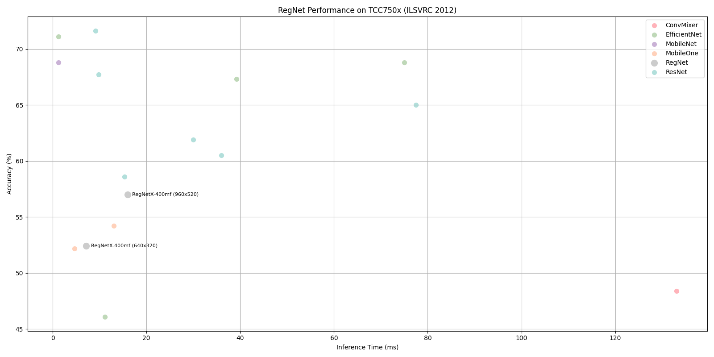

# RegNet Benchmark on TCC750x

The following table shows benchmark results for the RegNetX-400mf model running on the TCC750x NPU.  
RegNet is a family of lightweight and efficient convolutional neural networks optimized for image classification tasks, particularly on embedded and mobile devices.   

The RegNetX-400mf model is evaluated using the ILSVRC 2012 (ImageNet) validation dataset and compiled with the tc-nn-toolkit.  
Click on the model name to download a tar file containing the model binary for TCC750x.

---

### 📊 Table Overview

| Column                    | Description                                                                 |
|--------------------------|-----------------------------------------------------------------------------|
| **Model**                | Name of the neural network model     |
| **Framework**            | Deep learning framework used (e.g., PyTorch\*, TFLite, ONNX)                  |
| **Dataset**              | Dataset used to benchmark model performance (e.g., ILSVRC 2012 (ImageNet) validation set with 50,000 images)  |
| **Input Size (WxHxC)**   | Input Size (Width × Height × Channels) of the input image required by the model                            |
| **Inference Time (ms)**  | Inference time measured on the TCC750x EVB using zero-padded input images                |
| **Accuracy**             | Top-1 classification accuracy on the ILSVRC 2012 (ImageNet) validation dataset (50,000 images)                   |
| **Quantization Bit**     | Bit-depth used for quantization (e.g., INT8)                                |
| **Compiled Model Files**   | Sizes of the compiled model components: Weight and Bias Binary (.bin) and Command Binary (.bin) for execution on TCC750x                    |
| **References**           | Link to the original repository of the model      

- - -

<table border="1" cellspacing="0" cellpadding="5">
    <thead>
        <tr>
            <th rowspan="2" colspan="2">Model</th>
            <th rowspan="2">Framework</th>
            <th rowspan="2">Dataset</th>
            <th rowspan="2">Input Size (WxHxC)</th>
            <th rowspan="2">Inference Time (ms)</th>
            <th colspan="2">Accuracy</th>
            <th rowspan="2">Quantization Bit</th>
            <th colspan="2">Compiled Model Files</th>
            <th rowspan="2">References</th>
        </tr>
        <tr>
            <th>FP32</th>
            <th>INT8</th>
            <th>Weight and Bias Binary Size (MB)</th>
            <th>Command Binary Size (KB)</th>
        </tr>
    </thead>
    <tbody>
        <tr>
            <td align="center" rowspan="2" colspan="1">RegNetX</td>
            <td align="center" rowspan="2" colspan="1"><a href="regnetx_400mf/">400mf</a></td>
            <td align="center">PyTorch</td>
            <td align="center">ILSVRC 2012</td>
            <td align="center">640x320x3</td>
            <td align="center">7.17</td>
            <td align="center">0.529</td>
            <td align="center">0.524</td>
            <td align="center">INT8 </td>
            <td align="center">23.37</td>
            <td align="center">32</td>
            <td align="center" rowspan="2" colspan="1"><a href="https://docs.pytorch.org/vision/main/models/generated/torchvision.models.regnet_y_400mf.html#torchvision.models.regnet_y_400mf">PyTorch</a></td>
        </tr>
        <tr>
            <td align="center">PyTorch</td>
            <td align="center">ILSVRC 2012</td>
            <td align="center">960x520x3</td>
            <td align="center">15.95</td>
            <td align="center">0.575</td>
            <td align="center">0.57</td>
            <td align="center">INT8 </td>
            <td align="center">23.37</td>
            <td align="center">47</td>
        </tr>
    </tbody>
</table>

- - -

## 📤 Output Format

- The model returns the index of the top-1 class with the highest confidence score among the 1,000 ImageNet classes.

- - -

### Footnote                
* PyTorch* models are converted to ONNX for deployment.
