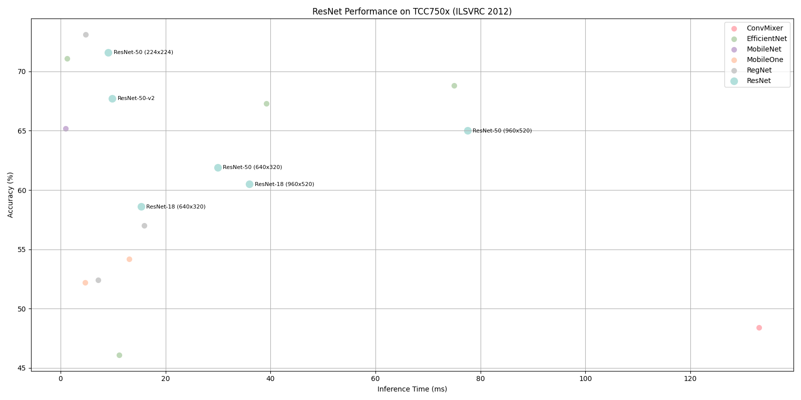

# ResNet Benchmark on TCC750x

The following table shows benchmark results for the ResNet-18, ResNet-34, ResNet-50, ResNet-101, ResNet-152 and ResNet-50-v2 models running on the TCC750x NPU.
ResNet is a family of lightweight and efficient convolutional neural networks optimized for image classification tasks, particularly on embedded and mobile devices.

All models are evaluated using the ILSVRC 2012 (ImageNet) validation dataset and compiled with the tc-nn-toolkit toolkit.
Click on the model name to download a tar file containing the model binary for TCC750x.

---

### 📊 Table Overview

| Column                    | Description                                                                 |
|--------------------------|-----------------------------------------------------------------------------|
| **Model**                | Name of the neural network model     |
| **Framework**            | Deep learning framework used (e.g., PyTorch\*, TFLite, ONNX)                  |
| **Dataset**              | Dataset used to benchmark model performance (e.g., ILSVRC 2012 (ImageNet) validation set with 50,000 images)  |
| **Input Size (WxHxC)**   | Input Size (Width × Height × Channels) of the input image required by the model                            |
| **Inference Time (ms)**  | Inference time measured on the TCC750x EVB using zero-padded input images                |
| **Accuracy**             | Top-1 classification accuracy on the ILSVRC 2012 (ImageNet) validation dataset (50,000 images)                   |
| **Quantization Bit**     | Bit-depth used for quantization (e.g., INT8)                                |
| **Compiled Model Files**   | Sizes of the compiled model components: Weight and Bias Binary (.bin) and Command Binary (.bin) for execution on TCC750x                    |
| **References**           | Link and license\** information for the original repository of the model

- - -

<table border="1" cellspacing="0" cellpadding="5">
    <thead>
        <tr>
            <th rowspan="2" colspan="2">Model</th>
            <th rowspan="2">Framework</th>
            <th rowspan="2">Dataset</th>
            <th rowspan="2">Input Size (WxHxC)</th>
            <th rowspan="2">Inference Time (ms)</th>
            <th colspan="2">Accuracy</th>
            <th rowspan="2">Quantization Bit</th>
            <th colspan="2">Compiled Model Files</th>
            <th colspan="2">References</th>
        </tr>
        <tr>
            <th>FP32</th>
            <th>INT8</th>
            <th>Weight and Bias Binary Size (MB)</th>
            <th>Command Binary Size (KB)</th>
            <th>Link</th>
            <th>License</th>
        </tr>
    </thead>
    <tbody>
        <tr>
            <td align="center" rowspan="9" class="model">ResNet</td>
            <td align="center" rowspan="2" class="variant"><a href="resnet_18/">18</a></td>
            <td align="center">PyTorch</td>
            <td align="center">ILSVRC 2012</td>
            <td align="center">640x320x3</td>
            <td align="right">15.34</td>
            <td align="right">0.588</td>
            <td align="right">0.586</td>
            <td align="center">INT8 </td>
            <td align="right">11.25</td>
            <td align="right">23</td>
            <td align="center" rowspan="2"><a href="https://docs.pytorch.org/vision/main/models/generated/torchvision.models.resnet18.html#torchvision.models.resnet18">PyTorch</a></td>
            <td align="center" rowspan="2">BSD-3-Clause</td>
        </tr>
        <tr>
            <td align="center">PyTorch</td>
            <td align="center">ILSVRC 2012</td>
            <td align="center">960x520x3</td>
            <td align="right">36.01</td>
            <td align="right">0.610</td>
            <td align="right">0.605</td>
            <td align="center">INT8 </td>
            <td align="right">11.25</td>
            <td align="right">64</td>
        </tr>
        <tr>
            <td align="center" rowspan="1" class="variant"><a href="resnet_34/">34</a></td>
            <td align="center">PyTorch</td>
            <td align="center">ILSVRC 2012</td>
            <td align="center">224x224x3</td>
            <td align="right">7.92</td>
            <td align="right">0.677</td>
            <td align="right">0.588</td>
            <td align="center">INT8 </td>
            <td align="right">21.40</td>
            <td align="right">24</td>
            <td align="center" rowspan="1"><a href="https://docs.pytorch.org/vision/main/models/generated/torchvision.models.resnet34.html#torchvision.models.resnet34">PyTorch</a></td>
            <td align="center" rowspan="1">BSD-3-Clause</td>
        </tr>
        <tr>
            <td align="center" rowspan="3" class="variant"><a href="resnet_50/">50</a></td>
            <td align="center">PyTorch</td>
            <td align="center">ILSVRC 2012</td>
            <td align="center">224x224x3</td>
            <td align="right">9.09</td>
            <td align="right">0.719</td>
            <td align="right">0.716</td>
            <td align="center">INT8 </td>
            <td align="right">25.10</td>
            <td align="right">30</td>
            <td align="center" rowspan="3"><a href="https://docs.pytorch.org/vision/main/models/generated/torchvision.models.resnet50.html#torchvision.models.resnet50">PyTorch</a></td>
            <td align="center" rowspan="3">BSD-3-Clause</td>
        </tr>
        <tr>
            <td align="center">PyTorch</td>
            <td align="center">ILSVRC 2012</td>
            <td align="center">640x320x3</td>
            <td align="right">29.95</td>
            <td align="right">0.620</td>
            <td align="right">0.619</td>
            <td align="center">INT8 </td>
            <td align="right">24.51</td>
            <td align="right">87</td>
        </tr>
        <tr>
            <td align="center">PyTorch</td>
            <td align="center">ILSVRC 2012</td>
            <td align="center">960x520x3</td>
            <td align="right">77.52</td>
            <td align="right">0.654</td>
            <td align="right">0.650</td>
            <td align="center">INT8 </td>
            <td align="right">24.51</td>
            <td align="right">273</td>
        </tr>
        <tr>
            <td align="center" rowspan="1" class="variant"><a href="resnet_50_v2/">50-v2</a></td>
            <td align="center">PyTorch</td>
            <td align="center">ILSVRC 2012</td>
            <td align="center">224x224x3</td>
            <td align="right">9.84</td>
            <td align="right">0.697</td>
            <td align="right">0.677</td>
            <td align="center">INT8 </td>
            <td align="right">25.30</td>
            <td align="right">32</td>
            <td align="center" rowspan="1"><a href="https://github.com/onnx/models/tree/main/validated/vision/classification/resnet">Github</a></td>
            <td align="center" rowspan="1">Apache-2.0</td>
        </tr>
        <tr>
            <td align="center" rowspan="1" class="variant"><a href="resnet_101/">101</a></td>
            <td align="center">PyTorch</td>
            <td align="center">ILSVRC 2012</td>
            <td align="center">224x224x3</td>
            <td align="right">14.22</td>
            <td align="right">0.799</td>
            <td align="right">0.618</td>
            <td align="center">INT8 </td>
            <td align="right">43.70</td>
            <td align="right">49</td>
            <td align="center" rowspan="1"><a href="https://docs.pytorch.org/vision/main/models/generated/torchvision.models.resnet101.html#torchvision.models.resnet101">PyTorch</a></td>
            <td align="center" rowspan="1">BSD-3-Clause</td>
        </tr>
        <tr>
            <td align="center" rowspan="1" class="variant"><a href="resnet_152/">152</a></td>
            <td align="center">PyTorch</td>
            <td align="center">ILSVRC 2012</td>
            <td align="center">224x224x3</td>
            <td align="right">14.22</td>
            <td align="right">0.799</td>
            <td align="right">0.618</td>
            <td align="center">INT8 </td>
            <td align="right">59.02</td>
            <td align="right">67</td>
            <td align="center" rowspan="1"><a href="https://docs.pytorch.org/vision/main/models/generated/torchvision.models.resnet152.html#torchvision.models.resnet152">PyTorch</a></td>
            <td align="center" rowspan="1">BSD-3-Clause</td>
        </tr>
    </tbody>
</table>

- - -

## 📤 Output Format

- The model's raw output consists of logit values corresponding to all 1000 ImageNet claasses.
- These outputs can be post-processed using softmax or argmax as needed.

- - -

### Footnote
* PyTorch* models are converted to ONNX for deployment.

* License\**:
  - Telechips Inc. is not responsible for any issues, damages, or losses resulting from the use of code downloaded from GitHub repositories provided by Telechips.
  - The performance results of neural networks (such as, mAP or inference time) are not subject to license term and may be used freely.
  - Any output generated by software execution may or may not be subject to license terms, depending on the contract and intended use of the output.

