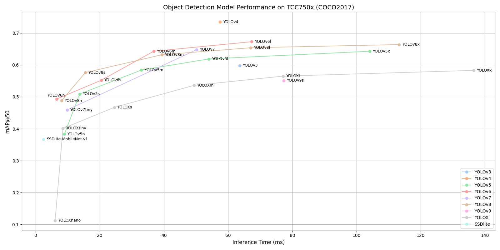

# Object Detection Benchmark on TCC750x

The following table shows benchmark results for various Object Detection models running on the TCC750x NPU.  
You can compare the performance of each model.  

Click on the model name to download a tar file containing the model binary for TCC750x.

---

### 📊 Table Overview

| Column                    | Description                                                                 |
|--------------------------|-----------------------------------------------------------------------------|
| **Model**                | Name of the neural network model     |
| **Framework**            | Deep learning framework used (e.g., PyTorch\*, TFLite, ONNX)                 |
| **Dataset**              | Dataset used to benchmark model performance (e.g., ILSVRC 2012 (ImageNet) validation set with 50,000 images)                               |
| **Input Size (WxHxC)**   | Input Size (Width × Height × Channels) of the input image required by the model                            |
| **Inference Time (ms)**  | Inference time measured on the TCC750x EVB using zero-padded input images.                               |
| **mAP**             | Mean Average Precision (mAP) is evaluated on the **COCO2017 validation dataset** (5,000 images) or the **VOC2007 test dataset** (4,952 images)                    |
| **Quantization Bit**     | Bit-depth used for quantization (e.g., INT8)                                |
| **Compiled Model Files**   | Sizes of the compiled model components: Weight and Bias Binary (.bin) and Command Binary (.bin) for execution on TCC750x    |
| **References**           | Link to the original repository of the model                         |

---
<table border="1" cellspacing="0" cellpadding="5">
    <thead>
        <tr>
            <th align="center" rowspan="2" colspan="2">Model</th>
            <th rowspan="2">Framework</th>
            <th rowspan="2">Dataset</th>
            <th rowspan="2">Input Size (WxHxC)</th>
            <th rowspan="2">Inference Time (ms)</th>
            <th colspan="2">mAP@50</th>
            <th rowspan="2">Quantization Bit</th>
            <th colspan="2">Compiled Model Files</th>
            <th rowspan="2">References</th>
        </tr>
        <tr>
            <th>FP32</th>
            <th>INT8</th>
            <th>Weight and Bias Binary (MB)</th>
            <th>Command Binary (KB)</th>
        </tr>
    </thead>
    <tbody>
        <tr>
            <td align="center" rowspan="2" class="model"><a href="SSDlite/README.md">SSDlite</a></td> <!-- Model -->
            <td align="center" class="variant"><a href="SSDlite/ssdlite_mobilenet_v1/">mb1</a></td>
            <td align="center">TFLite</td> <!-- Framework -->
            <td align="center">COCO2017</td> <!-- Detections/DataSet -->
            <td align="center">320x320x3</td> <!-- Input Size (WxHxC) -->
            <td align="center">2.46</td>
            <td align="center">0.376</td>
            <td align="center">0.367</td>
            <td align="center">INT8 </td>
            <td align="center">7.25</td>
            <td align="center">41</td>
            <td align="center"><a href="https://tfhub.dev/iree/lite-model/ssd_mobilenet_v1_100_320/fp32/nms/1">GitHub<a></td> <!-- References: Link -->
        </tr>
        <tr>
            <td align="center" class="variant"><a href="SSDlite/ssdlite_mobilenet_v2/">mb2</a></td> <!-- Model -->
            <td align="center">ONNX</td> <!-- Framework -->
            <td align="center">VOC2007</td> <!-- Detections/DataSet -->
            <td align="center">300x300x3</td> <!-- Input Size (WxHxC) -->
            <td align="center">2</td>
            <td align="center">0.661</td>
            <td align="center">0.651</td>
            <td align="center">INT8 </td>
            <td align="center">4.04</td>
            <td align="center">54</td>
            <td align="center"><a href="https://github.com/openedges/pytorch-ssd">GitHub<a></td> <!-- References: Link -->
        </tr>
        <tr>
            <td align="center" rowspan="1" class="model"><a href="YOLO/yolov3/README.md">YOLOv3</a></td> <!-- Model -->
            <td align="center" class="variant"><a href="YOLO/yolov3/yolov3">-</a></td>
            <td align="center">PyTorch</td> <!-- Framework -->
            <td align="center">COCO2017</td> <!-- Detections/DataSet -->
            <td align="center">640x640x3</td> <!-- Input Size (WxHxC) -->
            <td align="center">63.6</td>
            <td align="center">0.63</td>
            <td align="center">0.598</td>
            <td align="center">INT8 </td>
            <td align="center">60.55</td>
            <td align="center">230</td>
            <td align="center"><a href="https://github.com/ultralytics/yolov3">GitHub<a></td> <!-- References: Link -->
        </tr>
        <tr>
            <td align="center" rowspan="1" class="model"><a href="YOLO/yolov4/README.md">YOLOv4</a></td> <!-- Model -->
            <td align="center" class="variant"><a href="YOLO/yolov4/yolov4">-</a></td>
            <td align="center">Darknet</td> <!-- Framework -->
            <td align="center">COCO2017</td> <!-- Detections/DataSet -->
            <td align="center">608x608x3</td> <!-- Input Size (WxHxC) -->
            <td align="center">57.5</td>
            <td align="center">0.748</td>
            <td align="center">0.735</td>
            <td align="center">INT8 </td>
            <td align="center">62.92</td>
            <td align="center">306</td>
            <td align="center"><a href="https://github.com/AlexeyAB/darknet/blob/master/cfg/yolov4.cfg">Github<a></td> <!-- References: Link -->
        </tr>
        <tr>
            <td align="center" rowspan="5" class="model"><a href="YOLO/yolov5/README.md">YOLOv5</a></td> <!-- Model -->
            <td align="center" class="variant"><a href="YOLO/yolov5/yolov5n/">n</a></td>
            <td align="center">PyTorch</td> <!-- Framework -->
            <td align="center">COCO2017</td> <!-- Detections/DataSet -->
            <td align="center">640x640x3</td> <!-- Input Size (WxHxC) -->
            <td align="center">8.97</td>
            <td align="center">0.418</td>
            <td align="center">0.383</td>
            <td align="center">INT8 </td>
            <td align="center">1.86</td>
            <td align="center">78</td>
            <td align="center" rowspan="5"><a href="https://github.com/ultralytics/yolov5">GitHub<a></td> <!-- References: Link -->
        </tr>
        <tr>
            <td align="center" class="variant"><a href="YOLO/yolov5/yolov5s/">s</a></td> <!-- Model -->
            <td align="center">PyTorch</td> <!-- Framework -->
            <td align="center">COCO2017</td> <!-- Detections/DataSet -->
            <td align="center">640x640x3</td> <!-- Input Size (WxHxC) -->
            <td align="center">13.74</td>
            <td align="center">0.533</td>
            <td align="center">0.509</td>
            <td align="center">INT8 </td>
            <td align="center">7.12</td>
            <td align="center">142</td>
        </tr>
        <tr>
            <td align="center" class="variant"><a href="YOLO/yolov5/yolov5m/">m</a></td> <!-- Model -->
            <td align="center">PyTorch</td> <!-- Framework -->
            <td align="center">COCO2017</td> <!-- Detections/DataSet -->
            <td align="center">640x640x3</td> <!-- Input Size (WxHxC) -->
            <td align="center">32.96</td>
            <td align="center">0.61</td>
            <td align="center">0.584</td>
            <td align="center">INT8 </td>
            <td align="center">20.81</td>
            <td align="center">185</td>
        </tr>
        <tr>
            <td align="center" class="variant"><a href="YOLO/yolov5/yolov5l/">l</a></td> <!-- Model -->
            <td align="center">PyTorch</td> <!-- Framework -->
            <td align="center">COCO2017</td> <!-- Detections/DataSet -->
            <td align="center">640x640x3</td> <!-- Input Size (WxHxC) -->
            <td align="center">54.01</td>
            <td align="center">0.644</td>
            <td align="center">0.619</td>
            <td align="center">INT8 </td>
            <td align="center">45.6</td>
            <td align="center">305</td>
        </tr>
        <tr>
            <td align="center" class="variant"><a href="YOLO/yolov5/yolov5x/">x</a></td> <!-- Model -->
            <td align="center">PyTorch</td> <!-- Framework -->
            <td align="center">COCO2017</td> <!-- Detections/DataSet -->
            <td align="center">640x640x3</td> <!-- Input Size (WxHxC) -->
            <td align="center">104.11</td>
            <td align="center">0.66</td>
            <td align="center">0.643</td>
            <td align="center">INT8 </td>
            <td align="center">84.97</td>
            <td align="center">459</td>
        </tr>
        <tr>
            <td align="center" rowspan="4" class="model"><a href="YOLO/yolov6/README.md">YOLOv6</a></td> <!-- Model -->
            <td align="center" class="variant"><a href="YOLO/yolov6/yolov6n/">n</a></td> <!-- Models: Variant -->
            <td align="center">PyTorch</td> <!-- Framework -->
            <td align="center">COCO2017</td> <!-- Detections/DataSet -->
            <td align="center">640x640x3</td> <!-- Input Size (WxHxC) -->
            <td align="center">6.5</td>
            <td align="center">0.514</td>
            <td align="center">0.493</td>
            <td align="center">INT8 </td>
            <td align="center">4.56</td>
            <td align="center">37</td>
            <td align="center" rowspan="4"><a href="https://github.com/meituan/YOLOv6">GitHub<a></td> <!-- References: Link -->
        </tr>
        <tr>
            <td align="center" class="variant"><a href="YOLO/yolov6/yolov6s/">s</a></td> <!-- Model -->
            <td align="center">PyTorch</td> <!-- Framework -->
            <td align="center">COCO2017</td> <!-- Detections/DataSet -->
            <td align="center">640x640x3</td> <!-- Input Size (WxHxC) -->
            <td align="center">20.43</td>
            <td align="center">0.597</td>
            <td align="center">0.552</td>
            <td align="center">INT8 </td>
            <td align="center">18.14</td>
            <td align="center">83</td>
        </tr>
        <tr>
            <td align="center" class="variant"><a href="YOLO/yolov6/yolov6m/">m</a></td> <!-- Model -->
            <td align="center">PyTorch</td> <!-- Framework -->
            <td align="center">COCO2017</td> <!-- Detections/DataSet -->
            <td align="center">640x640x3</td> <!-- Input Size (WxHxC) -->
            <td align="center">36.8</td>
            <td align="center">0.648</td>
            <td align="center">0.643</td>
            <td align="center">INT8 </td>
            <td align="center">34.12</td>
            <td align="center">113</td>
        </tr>
        <tr>
            <td align="center" class="variant"><a href="YOLO/yolov6/yolov6l/">l</a></td> <!-- Model -->
            <td align="center">PyTorch</td> <!-- Framework -->
            <td align="center">COCO2017</td> <!-- Detections/DataSet -->
            <td align="center">640x640x3</td> <!-- Input Size (WxHxC) -->
            <td align="center">67.35</td>
            <td align="center">0.683</td>
            <td align="center">0.673</td>
            <td align="center">INT8 </td>
            <td align="center">58.31</td>
            <td align="center">237</td>
        </tr>
        <tr>
            <td align="center" rowspan="2" class="model"><a href="YOLO/yolov7/README.md">YOLOv7</a></td> <!-- Model -->
            <td align="center" class="variant"><a href="YOLO/yolov7/yolov7">-</a></td>
            <td align="center">PyTorch</td> <!-- Framework -->
            <td align="center">COCO2017</td> <!-- Detections/DataSet -->
            <td align="center">640x640x3</td> <!-- Input Size (WxHxC) -->
            <td align="center">50.21</td>
            <td align="center">0.662</td>
            <td align="center">0.648</td>
            <td align="center">INT8 </td>
            <td align="center">36.11</td>
            <td align="center">242</td>
            <td align="center" rowspan="2"><a href="https://github.com/WongKinYiu/yolov7">GitHub<a></td> <!-- References: Link -->
        </tr>
        <!-- 여기야~!!! -->
        <tr>
            <td align="center" class="variant"><a href="YOLO/yolov7/yolov7_tiny/">tiny</a></td>
            <td align="center">PyTorch</td> <!-- Framework -->
            <td align="center">COCO2017</td> <!-- Detections/DataSet -->
            <td align="center">640x640x3</td>  <!-- Input Size (WxHxC) -->
            <td align="center">9.84</td>
            <td align="center">0.488</td>
            <td align="center">0.459</td>
            <td align="center">INT8 </td>
            <td align="center">6.11</td>
            <td align="center">59</td>
        </tr>
        </tr>
        <tr>
            <td align="center" rowspan="5" class="model"><a href="YOLO/yolov8/README.md">YOLOv8</a></td> <!-- Model -->
            <td align="center" class="variant"><a href="YOLO/yolov8/yolov8n/">n</a></td>
            <td align="center">PyTorch</td> <!-- Framework -->
            <td align="center">COCO2017</td> <!-- Detections/DataSet -->
            <td align="center">640x640x3</td> <!-- Input Size (WxHxC) -->
            <td align="center">8.09</td>
            <td align="center">0.501</td>
            <td align="center">0.488</td>
            <td align="center">INT8 </td>
            <td align="center">3.15</td>
            <td align="center">70</td>
            <td align="center" rowspan="5"><a href="https://github.com/ultralytics/ultralytics">GitHub<a></td> <!-- References: Link -->
        </tr>
        <tr>
            <td align="center" class="variant"><a href="YOLO/yolov8/yolov8s/">s</a></td> <!-- Model -->
            <td align="center">PyTorch</td> <!-- Framework -->
            <td align="center">COCO2017</td> <!-- Detections/DataSet -->
            <td align="center">640x640x3</td> <!-- Input Size (WxHxC) -->
            <td align="center">15.49</td>
            <td align="center">0.586</td>
            <td align="center">0.576</td>
            <td align="center">INT8 </td>
            <td align="center">10.93</td>
            <td align="center">91</td>
        </tr>
        <tr>
            <td align="center" class="variant"><a href="YOLO/yolov8/yolov8m/">m</a></td> <!-- Model -->
            <td align="center">PyTorch</td> <!-- Framework -->
            <td align="center">COCO2017</td> <!-- Detections/DataSet -->
            <td align="center">640x640x3</td> <!-- Input Size (WxHxC) -->
            <td align="center">39.31</td>
            <td align="center">0.644</td>
            <td align="center">0.632</td>
            <td align="center">INT8 </td>
            <td align="center">25.39</td>
            <td align="center">153</td>
        </tr>
        <tr>
            <td align="center" class="variant"><a href="YOLO/yolov8/yolov8l/">l</a></td> <!-- Model -->
            <td align="center">PyTorch</td> <!-- Framework -->
            <td align="center">COCO2017</td> <!-- Detections/DataSet -->
            <td align="center">640x640x3</td> <!-- Input Size (WxHxC) -->
            <td align="center">67.04</td>
            <td align="center">0.67</td>
            <td align="center">0.654</td>
            <td align="center">INT8 </td>
            <td align="center">42.72</td>
            <td align="center">245</td>
        </tr>
        <tr>
            <td align="center" class="variant"><a href="YOLO/yolov8/yolov8x/">x</a></td> <!-- Model -->
            <td align="center">PyTorch</td> <!-- Framework -->
            <td align="center">COCO2017</td> <!-- Detections/DataSet -->
            <td align="center">640x640x3</td> <!-- Input Size (WxHxC) -->
            <td align="center">113.31</td>
            <td align="center">0.681</td>
            <td align="center">0.664</td>
            <td align="center">INT8 </td>
            <td align="center">66.85</td>
            <td align="center">434</td>
        </tr>
        <tr>
            <td align="center" rowspan="1" class="model"><a href="YOLO/yolov9/README.md">YOLOv9</a></td> <!-- Model -->
            <td align="center" class="variant"><a href="YOLO/yolov9/yolov9s/">s</a></td>
            <td align="center">PyTorch</td> <!-- Framework -->
            <td align="center">COCO2017</td> <!-- Detections/DataSet -->
            <td align="center">640x640x3</td> <!-- Input Size (WxHxC) -->
            <td align="center">77.34</td>
            <td align="center">0.562</td>
            <td align="center">0.551</td>
            <td align="center">INT8 </td>
            <td align="center">7.343</td>
            <td align="center">132</td>
            <td align="center" rowspan="1"><a href="https://github.com/ultralytics/ultralytics">GitHub<a></td> <!-- References: Link -->
        </tr>
        <tr>
            <td align="center" rowspan="6" class="model"><a href="YOLO/yoloX/README.md">YOLOX</a></td> <!-- Model -->
            <td align="center" class="variant"><a href="YOLO/yoloX/yolox_s/">s</a></td> <!-- Model -->
            <td align="center">PyTorch</td> <!-- Framework -->
            <td align="center">COCO2017</td> <!-- Detections/DataSet -->
            <td align="center">640x640x3</td> <!-- Input Size (WxHxC) -->
            <td align="center">24.52</td>
            <td align="center">0.473</td>
            <td align="center">0.467</td>
            <td align="center">INT8 </td>
            <td align="center">8.82</td>
            <td align="center">186</td>
            <td align="center" rowspan="6"><a href="https://github.com/Megvii-BaseDetection/YOLOX">GitHub<a></td> <!-- References: Link -->
        </tr>
        <tr>
            <td align="center" class="variant"><a href="YOLO/yoloX/yolox_m/">m</a></td> <!-- Model -->
            <td align="center">PyTorch</td> <!-- Framework -->
            <td align="center">COCO2017</td> <!-- Detections/DataSet -->
            <td align="center">640x640x3</td> <!-- Input Size (WxHxC) -->
            <td align="center">49.35</td>
            <td align="center">0.542</td>
            <td align="center">0.536</td>
            <td align="center">INT8 </td>
            <td align="center">24.86</td>
            <td align="center">235</td>
        </tr>
        <tr>
            <td align="center" class="variant"><a href="YOLO/yoloX/yolox_l/">l</a></td> <!-- Model -->
            <td align="center">PyTorch</td> <!-- Framework -->
            <td align="center">COCO2017</td> <!-- Detections/DataSet -->
            <td align="center">640x640x3</td> <!-- Input Size (WxHxC) -->
            <td align="center">77.11</td>
            <td align="center">0.572</td>
            <td align="center">0.565</td>
            <td align="center">INT8 </td>
            <td align="center">53.08</td>
            <td align="center">370</td>
        </tr>
        <tr>
            <td align="center" class="variant"><a href="YOLO/yoloX/yolox_x/">x</a></td> <!-- Model -->
            <td align="center">PyTorch</td> <!-- Framework -->
            <td align="center">COCO2017</td> <!-- Detections/DataSet -->
            <td align="center">640x640x3</td> <!-- Input Size (WxHxC) -->
            <td align="center">136.51</td>
            <td align="center">0.591</td>
            <td align="center">0.583</td>
            <td align="center">INT8 </td>
            <td align="center">97.01</td>
            <td align="center">558</td>
        </tr>
        <tr>
            <td align="center" class="variant"><a href="YOLO/yoloX/yolox_tiny/">tiny</a></td> <!-- Model -->
            <td align="center">PyTorch</td> <!-- Framework -->
            <td align="center">COCO2017</td> <!-- Detections/DataSet -->
            <td align="center">416x416x3</td> <!-- Input Size (WxHxC) -->
            <td align="center">8.53</td>
            <td align="center">0.411</td>
            <td align="center">0.401</td>
            <td align="center">INT8 </td>
            <td align="center">5.04</td>
            <td align="center">61</td>
        </tr>
        <tr>
            <td align="center" class="variant"><a href="YOLO/yoloX/yolox_nano/">nano</a></td> <!-- Model -->
            <td align="center">PyTorch</td> <!-- Framework -->
            <td align="center">COCO2017</td> <!-- Detections/DataSet -->
            <td align="center">416x416x3</td> <!-- Input Size (WxHxC) -->
            <td align="center">6.09</td>
            <td align="center">0.326</td>
            <td align="center">0.112</td>
            <td align="center">INT8 </td>
            <td align="center">0.93</td>
            <td align="center">62</td>
        </tr>
    </tbody>
</table>

- - -

### Footnote                
* PyTorch* models are converted to ONNX for deployment.

