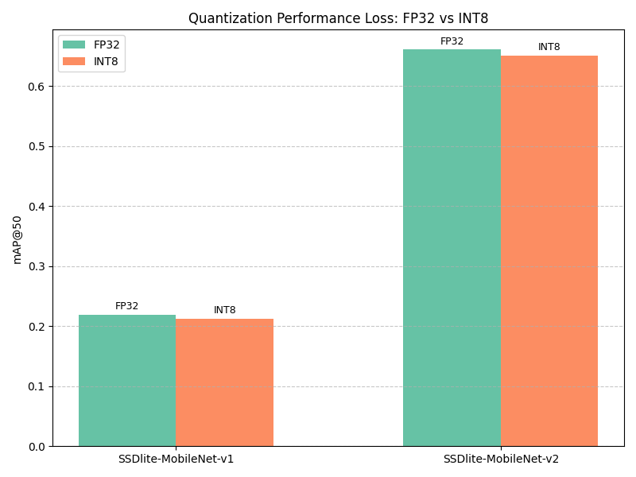

# SSDlite Series Benchmark on TCC750x

The following table shows benchmark results for the SSDlite-MobileNet-v1 and SSDlite-MobileNet-v2 object detection models running on the TCC750x NPU.  
SSDlite is a lightweight and efficient object detection model designed for mobile and embedded devices, offering a good trade-off between speed and accuracy.  
SSDlite is a variant of the original SSD model with depthwise separable convolutions for reduced computation.

Click on the model name to download a tar file containing the model binary.

---

### 📊 Table Overview

| Column                    | Description                                                                 |
|--------------------------|-----------------------------------------------------------------------------|
| **Model**                | Name of the neural network model     |
| **Framework**            | Deep learning framework used (e.g., PyTorch\*, TFLite, ONNX)                   |
| **Dataset**              | Dataset used to benchmark model performance                                      |
| **Input Size (WxHxC)**   | Input Size (Width × Height × Channels) of the input image required by the model                            |
| **Inference Time (ms)**  | Inference time measured on the TCC750x EVB using zero-padded input images.                               |
| **mAP**             | Mean Average Precision (mAP) is evaluated on the **COCO2017 validation dataset** (5,000 images) or the **VOC2007 test dataset** (4,952 images)                    |
| **Quantization Bit**     | Bit-depth used for quantization (e.g., INT8)                                |
| **Compiled Model Files**   | Sizes of the compiled model components: Weight and Bias Binary (.bin) and Command Binary (.bin) for execution on TCC750x                    |
| **References**           | Link to the original repository of the model                         |

---

<table border="1" cellspacing="0" cellpadding="5">
    <thead>
        <tr>
            <th align="center" rowspan="2" colspan="2">Model</th>
            <th rowspan="2">Framework</th>
            <th rowspan="2">Dataset</th>
            <th rowspan="2">Input Size (WxHxC)</th>
            <th rowspan="2">Inference Time (ms)</th>
            <th colspan="2">mAP@50:95</th>
            <th th align="center" colspan="2">mAP@50</th>
            <th rowspan="2">Quantization Bit</th>
            <th colspan="2">Compiled Model Files</th>
            <th rowspan="2">References</th>
        </tr>
        <tr>
            <th>FP32</th>
            <th>INT8</th>
            <th>FP32</th>
            <th>INT8</th>
            <th>Weight and Bias Binary (MB)</th>
            <th>Command Binary (KB)</th>
        </tr>
    </thead>
    <tbody>
        <tr>
            <td align="center" rowspan="2" class="model">SSDlite</td> <!-- Model -->
            <td align="center" class="variant"><a href="./ssdlite_mobilenet_v1/">mb1</a></td>
            <td align="center">TFLite</td> <!-- Framework -->
            <td align="center">COCO2017</td> <!-- Detections/DataSet -->
            <td align="center">320x320x3</td> <!-- Input Size (WxHxC) -->
            <td align="center">2.46</td> <!-- Inference Time(msec): EVB -->
            <td align="center">0.219</td> <!-- Evaluation Result: FP32 -->
            <td align="center">0.212</td> <!-- Evaluation Result: INT8 -->
            <td align="center">0.376</td> <!-- Evaluation Result: FP32 IoU=0.50 -->
            <td align="center">0.367</td> <!-- Evaluation Result: INT8 IoU=0.50 -->
            <td align="center">INT8</td> <!-- Quantization Bit -->
            <td align="center">7.25</td>
            <td align="center">41</td>
            <td align="center"><a href="https://tfhub.dev/iree/lite-model/ssd_mobilenet_v1_100_320/fp32/nms/1">GitHub<a></td> <!-- References: Link -->
        </tr>
        <tr>
            <td align="center" class="variant"><a href="./ssdlite_mobilenet_v2/">mb2</a></td> <!-- Model -->
            <td align="center">ONNX</td> <!-- Framework -->
            <td align="center">VOC2007</td> <!-- Detections/DataSet -->
            <td align="center">300x300x3</td> <!-- Input Size (WxHxC) -->
            <td align="center">2.00</td> <!-- Inference Time(msec): EVB -->
            <td align="center">-</td> <!-- Evaluation Result: FP32 -->
            <td align="center">-</td> <!-- Evaluation Result: INT8 -->
            <td align="center">0.661</td> <!-- Evaluation Result: FP32 IoU=0.50 -->
            <td align="center">0.651</td> <!-- Evaluation Result: INT8 IoU=0.50 -->
            <td align="center">INT8</td> <!-- Quantization Bit -->
            <td align="center">4.04</td>
            <td align="center">54</td>
            <td align="center"><a href="https://github.com/openedges/pytorch-ssd">GitHub<a></td> <!-- References: Link -->
        </tr>
    </tbody>
</table>

---

## 📤 Output Format

- The output of an SSDlite model is a set of bounding boxes with associated class predictions and confidence scores.
- These raw outputs undergo post-processing, which includes:
  - Applying sigmoid/softmax activations to normalize outputs
  - Filtering boxes based on confidence thresholds
  - Applying Non-Maximum Suppression (NMS) to remove overlapping boxes

- The final post-processed output includes a list of detected objects, each containing:
  - Class label
  - Confidence score
  - Bounding box coordinates (x_min, y_min, x_max, and y_max)

- - -

### Footnote                
* PyTorch* models are converted to ONNX for deployment.

