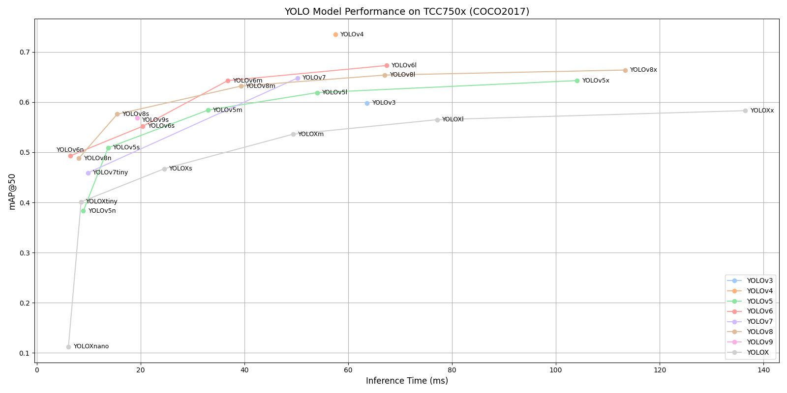

# YOLO Series Benchmark on TCC750x

The following table shows benchmark results for various YOLO object detection models running on the TCC750x NPU.
YOLO models are widely known for their real-time performance and high accuracy in detecting multiple objects in a single pass over the image.

Click on the model name to download a tar file containing the model binary for TCC750x.

**Note**: YOLO stands for You Only Look Once.

---

### 📊 Table Overview

| Column                    | Description                                                                 |
|--------------------------|-----------------------------------------------------------------------------|
| **Model**                | Name of the neural network model     |
| **Framework**            | Deep learning framework used (e.g., PyTorch\*, TFLite, ONNX)                   |
| **Dataset**              | Dataset used to benchmark model performance                                 |
| **Input Size (WxHxC)**   | Input Size (Width × Height × Channels) of the input image required by the model                            |
| **Inference Time (ms)**  | Inference time measured on the N-Dolphin EVB by using zero-padded input images                             |
| **mAP**             | Mean Average Precision (mAP) is evaluated on the **COCO2017 validation dataset** (5,000 images)                    |
| **Quantization Bit**     | Bit-depth used for quantization (e.g., INT8)                                |
| **Compiled Model Files**   | Sizes of the compiled model components: Weight and Bias Binary (.bin) and Command Binary (.bin) for execution on TCC750x                    |
| **References**           | Link and license\** information for the original repository of the model                         |

---

<table border="1" cellspacing="0" cellpadding="5">
    <thead>
        <tr>
            <th align="center" rowspan="2" colspan="2">Model</th>
            <th align="center" rowspan="2">Framework</th>
            <th align="center" rowspan="2">Dataset</th>
            <th align="center" rowspan="2">Input Size (WxHxC)</th>
            <th align="center" rowspan="2">Inference Time (ms)</th>
            <th align="center" colspan="2">mAP@50:95</th>
            <th align="center" colspan="2">mAP@50</th>
            <th align="center" rowspan="2">Quantization Bit</th>
            <th align="center" colspan="2">Compiled Model Files</th>
            <th align="center" colspan="2">References</th>
        </tr>
        <tr>
            <th>FP32</th>
            <th>INT8</th>
            <th>FP32</th>
            <th>INT8</th>
            <th>Weight and Bias Binary (MB)</th>
            <th>Command Binary (KB)</th>
            <th>Link</th>
            <th>License</th>
        </tr>
    </thead>
    <tbody>
        <tr>
            <td align="center" colspan="2"><a href="./yolov3/yolov3/">YOLOv3</a></td> <!-- Model -->
            <td align="center">PyTorch</td> <!-- Framework -->
            <td align="center">COCO2017</td> <!-- Detections/DataSet -->
            <td align="center">640x640x3</td> <!-- Input Size (WxHxC) -->
            <td align="right">63.60</td>
            <td align="right">0.439</td>
            <td align="right">0.386</td>
            <td align="right">0.630</td>
            <td align="right">0.598</td>
            <td align="center">INT8 </td>
            <td align="right">60.55</td>
            <td align="right">230</td>
            <td align="center"><a href="https://github.com/ultralytics/yolov3">GitHub<a></td> <!-- References: Link -->
            <td align="center">AGPL-3.0</td>
        </tr>
        <tr>
            <td align="center" colspan="2"><a href="./yolov4/yolov4/">YOLOv4</a></td> <!-- Model -->
            <td align="center">Darknet</td> <!-- Framework -->
            <td align="center">COCO2017</td> <!-- Detections/DataSet -->
            <td align="center">608x608x3</td> <!-- Input Size (WxHxC) -->
            <td align="right">57.50</td>
            <td align="right">0.501</td>
            <td align="right">0.402</td>
            <td align="right">0.748</td>
            <td align="right">0.735</td>
            <td align="center">INT8 </td>
            <td align="right">62.92</td>
            <td align="right">306</td>
            <td align="center"><a href="https://github.com/AlexeyAB/darknet/blob/master/cfg/yolov4.cfg">Github<a></td> <!-- References: Link -->
            <td align="center">YOLO</td>
        </tr>
        <tr>
            <td align="center" rowspan="5" class="model">YOLOv5</td> <!-- Model -->
            <td align="center" class="variant"><a href="./yolov5/yolov5n/">n</a></td>
            <td align="center">PyTorch</td> <!-- Framework -->
            <td align="center">COCO2017</td> <!-- Detections/DataSet -->
            <td align="center">640x640x3</td> <!-- Input Size (WxHxC) -->
            <td align="right">8.97</td>
            <td align="right">0.246</td>
            <td align="right">0.213</td>
            <td align="right">0.418</td>
            <td align="right">0.383</td>
            <td align="center">INT8 </td>
            <td align="right">1.86</td>
            <td align="right">78</td>
            <td align="center" rowspan="5"><a href="https://github.com/ultralytics/yolov5">GitHub<a></td> <!-- References: Link -->
            <td align="center" rowspan="5">AGPL-3.0</td>
        </tr>
        <tr>
            <td align="center" class="variant"><a href="./yolov5/yolov5s/">s</a></td> <!-- Model -->
            <td align="center">PyTorch</td> <!-- Framework -->
            <td align="center">COCO2017</td> <!-- Detections/DataSet -->
            <td align="center">640x640x3</td> <!-- Input Size (WxHxC) -->
            <td align="right">13.74</td>
            <td align="right">0.342</td>
            <td align="right">0.303</td>
            <td align="right">0.533</td>
            <td align="right">0.509</td>
            <td align="center">INT8 </td>
            <td align="right">7.12</td>
            <td align="right">142</td>
        </tr>
        <tr>
            <td align="center" class="variant"><a href="./yolov5/yolov5m/">m</a></td> <!-- Model -->
            <td align="center">PyTorch</td> <!-- Framework -->
            <td align="center">COCO2017</td> <!-- Detections/DataSet -->
            <td align="center">640x640x3</td> <!-- Input Size (WxHxC) -->
            <td align="right">32.96</td>
            <td align="right">0.424</td>
            <td align="right">0.385</td>
            <td align="right">0.61</td>
            <td align="right">0.584</td>
            <td align="center">INT8 </td>
            <td align="right">20.81</td>
            <td align="right">185</td>
        </tr>
        <tr>
            <td align="center" class="variant"><a href="./yolov5/yolov5l/">l</a></td> <!-- Model -->
            <td align="center">PyTorch</td> <!-- Framework -->
            <td align="center">COCO2017</td> <!-- Detections/DataSet -->
            <td align="center">640x640x3</td> <!-- Input Size (WxHxC) -->
            <td align="right">54.01</td>
            <td align="right">0.461</td>
            <td align="right">0.406</td>
            <td align="right">0.644</td>
            <td align="right">0.619</td>
            <td align="center">INT8 </td>
            <td align="right">45.60</td>
            <td align="right">305</td>
        </tr>
        <tr>
            <td align="center" class="variant"><a href="./yolov5/yolov5x/">x</a></td> <!-- Model -->
            <td align="center">PyTorch</td> <!-- Framework -->
            <td align="center">COCO2017</td> <!-- Detections/DataSet -->
            <td align="center">640x640x3</td> <!-- Input Size (WxHxC) -->
            <td align="right">104.11</td>
            <td align="right">0.478</td>
            <td align="right">0.437</td>
            <td align="right">0.66</td>
            <td align="right">0.643</td>
            <td align="center">INT8 </td>
            <td align="right">84.97</td>
            <td align="right">459</td>
        </tr>
        <tr>
            <td align="center" rowspan="4" class="model">YOLOv6</td> <!-- Model -->
            <td align="center" class="variant"><a href="./yolov6/yolov6n/">n</a></td> <!-- Models: Variant -->
            <td align="center">PyTorch</td> <!-- Framework -->
            <td align="center">COCO2017</td> <!-- Detections/DataSet -->
            <td align="center">640x640x3</td> <!-- Input Size (WxHxC) -->
            <td align="right">6.50</td>
            <td align="right">0.353</td>
            <td align="right">0.332</td>
            <td align="right">0.514</td>
            <td align="right">0.493</td>
            <td align="center">INT8 </td>
            <td align="right">4.56</td>
            <td align="right">37</td>
            <td align="center" rowspan="4"><a href="https://github.com/meituan/YOLOv6">GitHub<a></td> <!-- References: Link -->
            <td align="center" rowspan="4">GPL-3.0</td>
        </tr>
        <tr>
            <td align="center" class="variant"><a href="./yolov6/yolov6s/">s</a></td> <!-- Model -->
            <td align="center">PyTorch</td> <!-- Framework -->
            <td align="center">COCO2017</td> <!-- Detections/DataSet -->
            <td align="center">640x640x3</td> <!-- Input Size (WxHxC) -->
            <td align="right">20.43</td>
            <td align="right">0.422</td>
            <td align="right">0.384</td>
            <td align="right">0.597</td>
            <td align="right">0.552</td>
            <td align="center">INT8 </td>
            <td align="right">18.14</td>
            <td align="right">83</td>
        </tr>
        <tr>
            <td align="center" class="variant"><a href="./yolov6/yolov6m/">m</a></td> <!-- Model -->
            <td align="center">PyTorch</td> <!-- Framework -->
            <td align="center">COCO2017</td> <!-- Detections/DataSet -->
            <td align="center">640x640x3</td> <!-- Input Size (WxHxC) -->
            <td align="right">36.80</td>
            <td align="right">0.468</td>
            <td align="right">0.462</td>
            <td align="right">0.648</td>
            <td align="right">0.643</td>
            <td align="center">INT8 </td>
            <td align="right">34.12</td>
            <td align="right">113</td>
        </tr>
        <tr>
            <td align="center" class="variant"><a href="./yolov6/yolov6l/">l</a></td> <!-- Model -->
            <td align="center">PyTorch</td> <!-- Framework -->
            <td align="center">COCO2017</td> <!-- Detections/DataSet -->
            <td align="center">640x640x3</td> <!-- Input Size (WxHxC) -->
            <td align="right">67.35</td>
            <td align="right">0.496</td>
            <td align="right">0.489</td>
            <td align="right">0.683</td>
            <td align="right">0.673</td>
            <td align="center">INT8 </td>
            <td align="right">58.31</td>
            <td align="right">237</td>
        </tr>
        <tr>
            <td align="center" rowspan="2" class="model">YOLOv7</td> <!-- Model -->
            <td align="center" class="variant"><a href="./yolov7/yolov7/">-</a></td>
            <td align="center">PyTorch</td> <!-- Framework -->
            <td align="center">COCO2017</td> <!-- Detections/DataSet -->
            <td align="center">640x640x3</td> <!-- Input Size (WxHxC) -->
            <td align="right">50.21</td>
            <td align="right">0.479</td>
            <td align="right">0.421</td>
            <td align="right">0.662</td>
            <td align="right">0.648</td>
            <td align="center">INT8 </td>
            <td align="right">36.11</td>
            <td align="right">242</td>
            <td align="center" rowspan="2"><a href="https://github.com/WongKinYiu/yolov7">GitHub<a></td> <!-- References: Link -->
            <td align="center" rowspan="2">GPL-3.0</td>
        </tr>
        <tr>
            <td align="center" class="variant"><a href="./yolov7/yolov7_tiny/">tiny</a></td>
            <td align="center">PyTorch</td> <!-- Framework -->
            <td align="center">COCO2017</td> <!-- Detections/DataSet -->
            <td align="center">640x640x3</td> <!-- Input Size (WxHxC) -->
            <td align="right">9.84</td>
            <td align="right">0.154</td>
            <td align="right">0.136</td>
            <td align="right">0.488</td>
            <td align="right">0.459</td>
            <td align="center">INT8 </td>
            <td align="right">6.11</td>
            <td align="right">59</td>
        </tr>
        <tr>
            <td align="center" rowspan="5" class="model">YOLOv8</td> <!-- Model -->
            <td align="center" class="variant"><a href="./yolov8/yolov8n/">n</a></td>
            <td align="center">PyTorch</td> <!-- Framework -->
            <td align="center">COCO2017</td> <!-- Detections/DataSet -->
            <td align="center">640x640x3</td> <!-- Input Size (WxHxC) -->
            <td align="right">8.09</td>
            <td align="right">0.344</td>
            <td align="right">0.331</td>
            <td align="right">0.501</td>
            <td align="right">0.488</td>
            <td align="center">INT8 </td>
            <td align="right">3.15</td>
            <td align="right">70</td>
            <td align="center" rowspan="5"><a href="https://github.com/ultralytics/ultralytics">GitHub<a></td> <!-- References: Link -->
            <td align="center" rowspan="5">AGPL-3.0</td>
        </tr>
        <tr>
            <td align="center" class="variant"><a href="./yolov8/yolov8s/">s</a></td> <!-- Model -->
            <td align="center">PyTorch</td> <!-- Framework -->
            <td align="center">COCO2017</td> <!-- Detections/DataSet -->
            <td align="center">640x640x3</td> <!-- Input Size (WxHxC) -->
            <td align="right">15.49</td>
            <td align="right">0.416</td>
            <td align="right">0.405</td>
            <td align="right">0.586</td>
            <td align="right">0.576</td>
            <td align="center">INT8 </td>
            <td align="right">10.93</td>
            <td align="right">91</td>
        </tr>
        <tr>
            <td align="center" class="variant"><a href="./yolov8/yolov8m/">m</a></td> <!-- Model -->
            <td align="center">PyTorch</td> <!-- Framework -->
            <td align="center">COCO2017</td> <!-- Detections/DataSet -->
            <td align="center">640x640x3</td> <!-- Input Size (WxHxC) -->
            <td align="right">39.31</td>
            <td align="right">0.472</td>
            <td align="right">0.458</td>
            <td align="right">0.644</td>
            <td align="right">0.632</td>
            <td align="center">INT8 </td>
            <td align="right">25.39</td>
            <td align="right">153</td>
        </tr>
        <tr>
            <td align="center" class="variant"><a href="./yolov8/yolov8l/">l</a></td> <!-- Model -->
            <td align="center">PyTorch</td> <!-- Framework -->
            <td align="center">COCO2017</td> <!-- Detections/DataSet -->
            <td align="center">640x640x3</td> <!-- Input Size (WxHxC) -->
            <td align="right">67.04</td>
            <td align="right">0.499</td>
            <td align="right">0.483</td>
            <td align="right">0.67</td>
            <td align="right">0.654</td>
            <td align="center">INT8 </td>
            <td align="right">42.72</td>
            <td align="right">245</td>
        </tr>
        <tr>
            <td align="center" class="variant"><a href="./yolov8/yolov8x/">x</a></td> <!-- Model -->
            <td align="center">PyTorch</td> <!-- Framework -->
            <td align="center">COCO2017</td> <!-- Detections/DataSet -->
            <td align="center">640x640x3</td> <!-- Input Size (WxHxC) -->
            <td align="right">113.31</td>
            <td align="right">0.508</td>
            <td align="right">0.493</td>
            <td align="right">0.681</td>
            <td align="right">0.664</td>
            <td align="center">INT8 </td>
            <td align="right">66.85</td>
            <td align="right">434</td>
        </tr>
        <tr>
            <td align="center" rowspan="1" class="model">YOLOv9</td> <!-- Model -->
            <td align="center" class="variant"><a href="./yolov9/yolov9s/">s</a></td>
            <td align="center">PyTorch</td> <!-- Framework -->
            <td align="center">COCO2017</td> <!-- Detections/DataSet -->
            <td align="center">640x640x3</td> <!-- Input Size (WxHxC) -->
            <td align="right">19.33</td>
            <td align="right">0.423</td>
            <td align="right">0.413</td>
            <td align="right">0.581</td>
            <td align="right">0.569</td>
            <td align="center">INT8 </td>
            <td align="right">7.34</td>
            <td align="right">132</td>
            <td align="center" rowspan="1"><a href="https://github.com/ultralytics/ultralytics">GitHub<a></td> <!-- References: Link -->
            <td align="center" rowspan="1">AGPL-3.0</td>
        </tr>
        <tr>
            <td align="center" rowspan="6" class="model">YOLOX</td> <!-- Model -->
            <td align="center" class="variant"><a href="./yoloX/yolox_s/">s</a></td> <!-- Model -->
            <td align="center">PyTorch</td> <!-- Framework -->
            <td align="center">COCO2017</td> <!-- Detections/DataSet -->
            <td align="center">640x640x3</td> <!-- Input Size (WxHxC) -->
            <td align="right">24.52</td>
            <td align="right">0.316</td>
            <td align="right">0.308</td>
            <td align="right">0.473</td>
            <td align="right">0.467</td>
            <td align="center">INT8 </td>
            <td align="right">8.82</td>
            <td align="right">186</td>
            <td align="center" rowspan="6"><a href="https://github.com/Megvii-BaseDetection/YOLOX">GitHub<a></td> <!-- References: Link -->
            <td align="center" rowspan="6">Apache-2.0</td>
        </tr>
        <tr>
            <td align="center" class="variant"><a href="./yoloX/yolox_m/">m</a></td> <!-- Model -->
            <td align="center">PyTorch</td> <!-- Framework -->
            <td align="center">COCO2017</td> <!-- Detections/DataSet -->
            <td align="center">640x640x3</td> <!-- Input Size (WxHxC) -->
            <td align="right">49.35</td>
            <td align="right">0.382</td>
            <td align="right">0.371</td>
            <td align="right">0.542</td>
            <td align="right">0.536</td>
            <td align="center">INT8 </td>
            <td align="right">24.86</td>
            <td align="right">235</td>
        </tr>
        <tr>
            <td align="center" class="variant"><a href="./yoloX/yolox_l/">l</a></td> <!-- Model -->
            <td align="center">PyTorch</td> <!-- Framework -->
            <td align="center">COCO2017</td> <!-- Detections/DataSet -->
            <td align="center">640x640x3</td> <!-- Input Size (WxHxC) -->
            <td align="right">77.11</td>
            <td align="right">0.414</td>
            <td align="right">0.403</td>
            <td align="right">0.572</td>
            <td align="right">0.565</td>
            <td align="center">INT8 </td>
            <td align="right">53.08</td>
            <td align="right">370</td>
        </tr>
        <tr>
            <td align="center" class="variant"><a href="./yoloX/yolox_x/">x</a></td> <!-- Model -->
            <td align="center">PyTorch</td> <!-- Framework -->
            <td align="center">COCO2017</td> <!-- Detections/DataSet -->
            <td align="center">640x640x3</td> <!-- Input Size (WxHxC) -->
            <td align="right">136.51</td>
            <td align="right">0.432</td>
            <td align="right">0.418</td>
            <td align="right">0.591</td>
            <td align="right">0.583</td>
            <td align="center">INT8 </td>
            <td align="right">97.01</td>
            <td align="right">558</td>
        </tr>
        <tr>
            <td align="center" class="variant"><a href="./yoloX/yolox_tiny/">tiny</a></td> <!-- Model -->
            <td align="center">PyTorch</td> <!-- Framework -->
            <td align="center">COCO2017</td> <!-- Detections/DataSet -->
            <td align="center">416x416x3</td> <!-- Input Size (WxHxC) -->
            <td align="right">8.53</td>
            <td align="right">0.265</td>
            <td align="right">0.255</td>
            <td align="right">0.411</td>
            <td align="right">0.401</td>
            <td align="center">INT8 </td>
            <td align="right">5.04</td>
            <td align="right">61</td>
        </tr>
        <tr>
            <td align="center" class="variant"><a href="./yoloX/yolox_nano/">nano</a></td> <!-- Model -->
            <td align="center">PyTorch</td> <!-- Framework -->
            <td align="center">COCO2017</td> <!-- Detections/DataSet -->
            <td align="center">416x416x3</td> <!-- Input Size (WxHxC) -->
            <td align="right">6.09</td>
            <td align="right">0.201</td>
            <td align="right">0.063</td>
            <td align="right">0.326</td>
            <td align="right">0.112</td>
            <td align="center">INT8 </td>
            <td align="right">0.93</td>
            <td align="right">62</td>
        </tr>
    </tbody>
</table>

## 📤 Output Format

- The raw output of a YOLO model is a tensor (or multiple tensors) containing a dense grid of predictions across different spatial locations and anchor boxes.
- These raw outputs undergo post-processing, which includes:
  - Applying sigmoid/softmax activations to normalize outputs
  - Filtering boxes based on confidence thresholds
  - Applying Non-maximum Suppression (NMS) to remove overlapping boxes

- The final post-processed output includes a list of detected objects, each containing:
  - Class label
  - Confidence score
  - Bounding box coordinates (x_min, y_min, x_max, and y_max)

- The number and format of output tensors may vary slightly depending on the YOLO version (e.g., v5, v6, v8, and YOLOX), but the core structure remains similar.

### Footnote
* PyTorch* models are converted to ONNX for deployment.

* License\**:
  - Telechips Inc. is not responsible for any issues, damages, or losses resulting from the use of code downloaded from GitHub repositories provided by Telechips.
  - The performance results of neural networks (such as, mAP or inference time) are not subject to license term and may be used freely.
  - Any output generated by software execution may or may not be subject to license terms, depending on the contract and intended use of the output.
