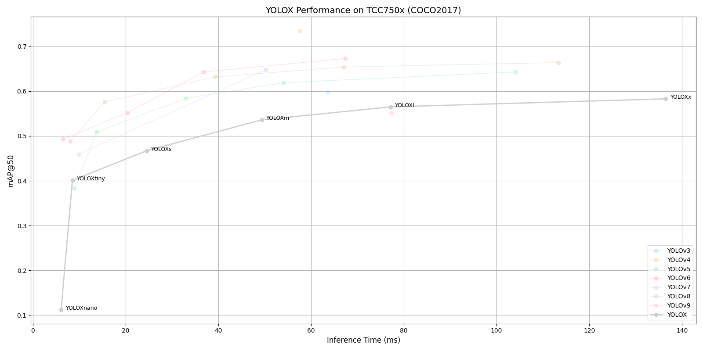

# YOLOX Benchmark on TCC750x

<table border="1" cellspacing="0" cellpadding="5">
    <thead>
        <tr>
            <th align="center" rowspan="2" colspan="2">Model</th>
            <th th align="center" rowspan="2">Framework</th>
            <th th align="center" rowspan="2">Dataset</th>
            <th th align="center" rowspan="2">Input Size (WxHxC)</th>
            <th align="center" rowspan="2">Inference Time (ms)</th>
            <th align="center" colspan="2">mAP@50:95</th>
            <th align="center" colspan="2">mAP@50</th>
            <th align="center" rowspan="2">Quantization Bit</th>
            <th align="center" colspan="2">Compiled Model Files</th>
            <th align="center" rowspan="2">References</th>
        </tr>
        <tr>
            <th>FP32</th>
            <th>INT8</th>
            <th>FP32</th>
            <th>INT8</th>
            <th>Weight and Bias Binary (MB)</th>
            <th>Command Binary (KB)</th>
        </tr>
    </thead>
    <tbody>
        <tr>
            <td align="center" rowspan="6" class="model">YOLOX</td> <!-- Model -->
            <td align="center" class="variant">s</td> <!-- Model -->
            <td align="center">PyTorch</td> <!-- Framework -->
            <td align="center">COCO2017</td> <!-- Detections/DataSet -->
            <td align="center">640x640x3</td> <!-- Input Size (WxHxC) -->
            <td align="center">24.52</td>
            <td align="center">0.316</td>
            <td align="center">0.308</td>
            <td align="center">0.473</td>
            <td align="center">0.467</td>
            <td align="center">INT8 </td>
            <td align="center">8.82</td>
            <td align="center">186</td>
            <td align="center" rowspan="6"><a href="https://github.com/Megvii-BaseDetection/YOLOX">GitHub</a></td> <!-- References: Link -->
        </tr>
        <tr>
            <td align="center" class="variant">m</td> <!-- Model -->
            <td align="center">PyTorch</td> <!-- Framework -->
            <td align="center">COCO2017</td> <!-- Detections/DataSet -->
            <td align="center">640x640x3</td> <!-- Input Size (WxHxC) -->
            <td align="center">49.35</td>
            <td align="center">0.382</td>
            <td align="center">0.371</td>
            <td align="center">0.542</td>
            <td align="center">0.536</td>
            <td align="center">INT8 </td>
            <td align="center">24.86</td>
            <td align="center">235</td>
        </tr>
        <tr>
            <td align="center" class="variant">l</td> <!-- Model -->
            <td align="center">PyTorch</td> <!-- Framework -->
            <td align="center">COCO2017</td> <!-- Detections/DataSet -->
            <td align="center">640x640x3</td> <!-- Input Size (WxHxC) -->
            <td align="center">77.11</td>
            <td align="center">0.414</td>
            <td align="center">0.403</td>
            <td align="center">0.572</td>
            <td align="center">0.565</td>
            <td align="center">INT8 </td>
            <td align="center">53.08</td>
            <td align="center">370</td>
        </tr>
        <tr>
            <td align="center" class="variant">x</td> <!-- Model -->
            <td align="center">PyTorch</td> <!-- Framework -->
            <td align="center">COCO2017</td> <!-- Detections/DataSet -->
            <td align="center">640x640x3</td> <!-- Input Size (WxHxC) -->
            <td align="center">136.51</td>
            <td align="center">0.432</td>
            <td align="center">0.418</td>
            <td align="center">0.591</td>
            <td align="center">0.583</td>
            <td align="center">INT8 </td>
            <td align="center">97.01</td>
            <td align="center">558</td>
        </tr>
        <tr>
            <td align="center" class="variant">tiny</td> <!-- Model -->
            <td align="center">PyTorch</td> <!-- Framework -->
            <td align="center">COCO2017</td> <!-- Detections/DataSet -->
            <td align="center">416x416x3</td> <!-- Input Size (WxHxC) -->
            <td align="center">8.53</td>
            <td align="center">0.265</td>
            <td align="center">0.255</td>
            <td align="center">0.411</td>
            <td align="center">0.401</td>
            <td align="center">INT8 </td>
            <td align="center">5.04</td>
            <td align="center">61</td>
        </tr>
        <tr>
            <td align="center" class="variant">nano</td> <!-- Model -->
            <td align="center">PyTorch</td> <!-- Framework -->
            <td align="center">COCO2017</td> <!-- Detections/DataSet -->
            <td align="center">416x416x3</td> <!-- Input Size (WxHxC) -->
            <td align="center">6.09</td>
            <td align="center">0.201</td>
            <td align="center">0.063</td>
            <td align="center">0.326</td>
            <td align="center">0.112</td>
            <td align="center">INT8 </td>
            <td align="center">0.93</td>
            <td align="center">62</td>
        </tr>
    </tbody>
</table>
