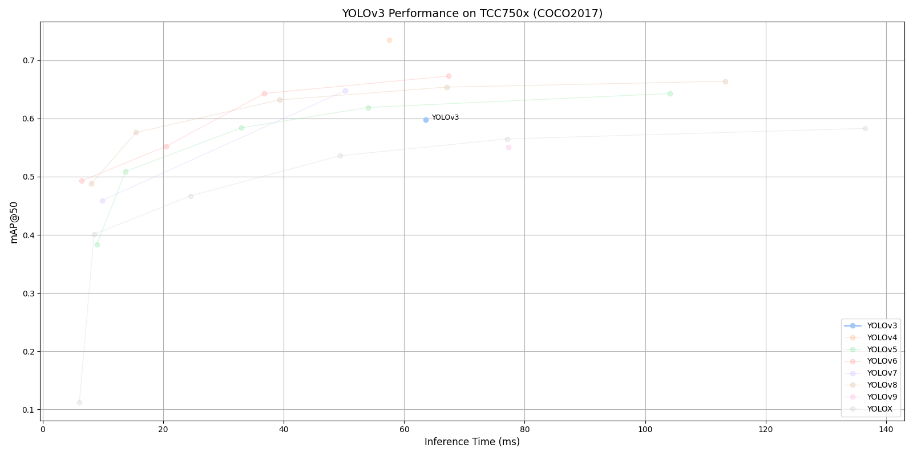

# YOLOv3 Benchmark on TCC750x

<table border="1" cellspacing="0" cellpadding="5">
    <thead>
        <tr>
            <th align="center" rowspan="2" colspan="2">Model</th>
            <th th align="center" rowspan="2">Framework</th>
            <th th align="center" rowspan="2">Dataset</th>
            <th th align="center" rowspan="2">Input Size (WxHxC)</th>
            <th align="center" rowspan="2">Inference Time (ms)</th>
            <th align="center" colspan="2">mAP@50:95</th>
            <th align="center" colspan="2">mAP@50</th>
            <th align="center" rowspan="2">Quantization Bit</th>
            <th align="center" colspan="2">Compiled Model Files</th>
            <th align="center" rowspan="2">References</th>
        </tr>
        <tr>
            <th>FP32</th>
            <th>INT8</th>
            <th>FP32</th>
            <th>INT8</th>
            <th>Weight and Bias Binary (MB)</th>
            <th>Command Binary (KB)</th>
        </tr>
    </thead>
    <tbody>
         <tr>
            <td align="center" colspan="2">YOLOv3</td> <!-- Model -->
            <td align="center">PyTorch</td> <!-- Framework -->
            <td align="center">COCO2017</td> <!-- Detections/DataSet -->
            <td align="center">640x640x3</td> <!-- Input Size (WxHxC) -->
            <td align="center">63.6</td>
            <td align="center">0.439</td>
            <td align="center">0.386</td>
            <td align="center">0.63</td>
            <td align="center">0.598</td>
            <td align="center">INT8 </td>
            <td align="center">60.55</td>
            <td align="center">230</td>
            <td align="center"><a href="https://github.com/ultralytics/yolov3">GitHub<a></td> <!-- References: Link -->
        </tr>
    </tbody>
</table>
