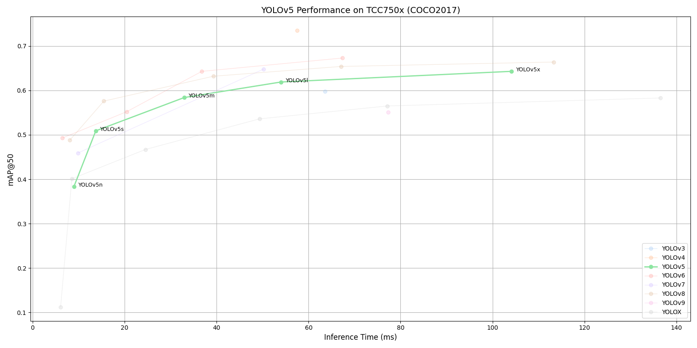

# YOLOv5 Benchmark on TCC750x

<table border="1" cellspacing="0" cellpadding="5">
    <thead>
        <tr>
            <th align="center" rowspan="2" colspan="2">Model</th>
            <th th align="center" rowspan="2">Framework</th>
            <th th align="center" rowspan="2">Dataset</th>
            <th th align="center" rowspan="2">Input Size (WxHxC)</th>
            <th align="center" rowspan="2">Inference Time (ms)</th>
            <th align="center" colspan="2">mAP@50:95</th>
            <th align="center" colspan="2">mAP@50</th>
            <th align="center" rowspan="2">Quantization Bit</th>
            <th align="center" colspan="2">Compiled Model Files</th>
            <th align="center" rowspan="2">References</th>
        </tr>
        <tr>
            <th>FP32</th>
            <th>INT8</th>
            <th>FP32</th>
            <th>INT8</th>
            <th>Weight and Bias Binary (MB)</th>
            <th>Command Binary (KB)</th>
        </tr>
    </thead>
    <tbody>
        <tr>
            <td align="center" rowspan="5" class="model">YOLOv5</td> <!-- Model -->
            <td align="center" class="variant">n</td>
            <td align="center">PyTorch</td> <!-- Framework -->
            <td align="center">COCO2017</td> <!-- Detections/DataSet -->
            <td align="center">640x640x3</td> <!-- Input Size (WxHxC) -->
            <td align="center">8.97</td>
            <td align="center">0.246</td>
            <td align="center">0.213</td>
            <td align="center">0.418</td>
            <td align="center">0.383</td>
            <td align="center">INT8 </td>
            <td align="center">1.86</td>
            <td align="center">78</td>
            <td align="center" rowspan="5"><a href="https://github.com/ultralytics/yolov5">GitHub<a></td> <!-- References: Link -->
        </tr>
        <tr>
            <td align="center" class="variant">s</td> <!-- Model -->
            <td align="center">PyTorch</td> <!-- Framework -->
            <td align="center">COCO2017</td> <!-- Detections/DataSet -->
            <td align="center">640x640x3</td> <!-- Input Size (WxHxC) -->
            <td align="center">13.74</td>
            <td align="center">0.342</td>
            <td align="center">0.303</td>
            <td align="center">0.533</td>
            <td align="center">0.509</td>
            <td align="center">INT8 </td>
            <td align="center">7.12</td>
            <td align="center">142</td>
        </tr>
        <tr>
            <td align="center" class="variant">m</td> <!-- Model -->
            <td align="center">PyTorch</td> <!-- Framework -->
            <td align="center">COCO2017</td> <!-- Detections/DataSet -->
            <td align="center">640x640x3</td> <!-- Input Size (WxHxC) -->
            <td align="center">32.96</td>
            <td align="center">0.424</td>
            <td align="center">0.385</td>
            <td align="center">0.61</td>
            <td align="center">0.584</td>
            <td align="center">INT8 </td>
            <td align="center">20.81</td>
            <td align="center">185</td>
        </tr>
        <tr>
            <td align="center" class="variant">l</td> <!-- Model -->
            <td align="center">PyTorch</td> <!-- Framework -->
            <td align="center">COCO2017</td> <!-- Detections/DataSet -->
            <td align="center">640x640x3</td> <!-- Input Size (WxHxC) -->
            <td align="center">54.01</td>
            <td align="center">0.461</td>
            <td align="center">0.406</td>
            <td align="center">0.644</td>
            <td align="center">0.619</td>
            <td align="center">INT8 </td>
            <td align="center">45.6</td>
            <td align="center">305</td>
        </tr>
        <tr>
            <td align="center" class="variant">x</td> <!-- Model -->
            <td align="center">PyTorch</td> <!-- Framework -->
            <td align="center">COCO2017</td> <!-- Detections/DataSet -->
            <td align="center">640x640x3</td> <!-- Input Size (WxHxC) -->
            <td align="center">104.11</td>
            <td align="center">0.478</td>
            <td align="center">0.437</td>
            <td align="center">0.66</td>
            <td align="center">0.643</td>
            <td align="center">INT8 </td>
            <td align="center">84.97</td>
            <td align="center">459</td>
        </tr>
    </tbody>
</table>
