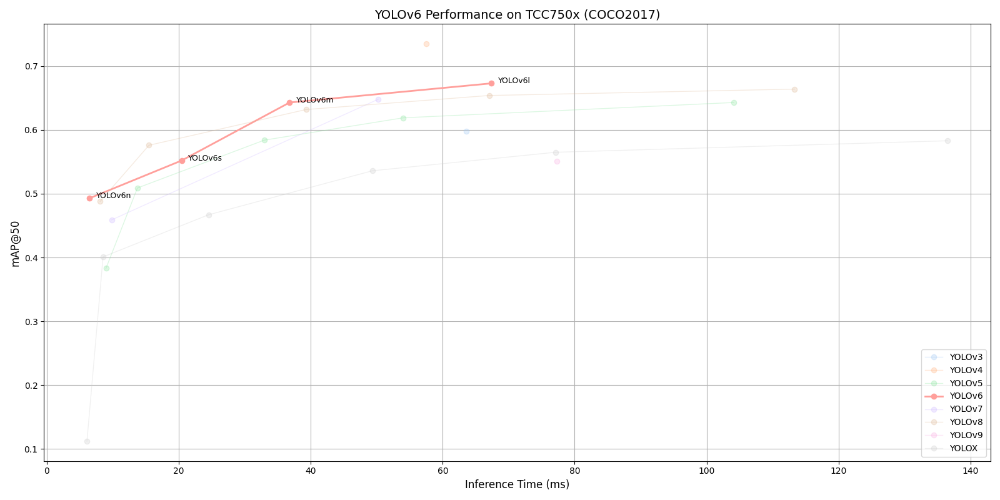

# YOLOv6 Benchmark on TCC750x

<table border="1" cellspacing="0" cellpadding="5">
    <thead>
        <tr>
            <th align="center" rowspan="2" colspan="2">Model</th>
            <th th align="center" rowspan="2">Framework</th>
            <th th align="center" rowspan="2">Dataset</th>
            <th th align="center" rowspan="2">Input Size (WxHxC)</th>
            <th align="center" rowspan="2">Inference Time (ms)</th>
            <th align="center" colspan="2">mAP@50:95</th>
            <th align="center" colspan="2">mAP@50</th>
            <th align="center" rowspan="2">Quantization Bit</th>
            <th align="center" colspan="2">Compiled Model Files</th>
            <th align="center" rowspan="2">References</th>
        </tr>
        <tr>
            <th>FP32</th>
            <th>INT8</th>
            <th>FP32</th>
            <th>INT8</th>
            <th>Weight and Bias Binary (MB)</th>
            <th>Command Binary (KB)</th>
        </tr>
    </thead>
    <tbody>
        <tr>
            <td align="center" rowspan="4" class="model">YOLOv6</td> <!-- Model -->
            <td align="center" class="variant">n</td> <!-- Models: Variant -->
            <td align="center">PyTorch</td> <!-- Framework -->
            <td align="center">COCO2017</td> <!-- Detections/DataSet -->
            <td align="center">640x640x3</td> <!-- Input Size (WxHxC) -->
            <td align="center">6.5</td>
            <td align="center">0.353</td>
            <td align="center">0.332</td>
            <td align="center">0.514</td>
            <td align="center">0.493</td>
            <td align="center">INT8 </td>
            <td align="center">4.56</td>
            <td align="center">37</td>
            <td align="center" rowspan="4"><a href="https://github.com/meituan/YOLOv6">GitHub<a></td> <!-- References: Link -->
        </tr>
        <tr>
            <td align="center" class="variant">s</td> <!-- Model -->
            <td align="center">PyTorch</td> <!-- Framework -->
            <td align="center">COCO2017</td> <!-- Detections/DataSet -->
            <td align="center">640x640x3</td> <!-- Input Size (WxHxC) -->
            <td align="center">20.43</td>
            <td align="center">0.422</td>
            <td align="center">0.384</td>
            <td align="center">0.597</td>
            <td align="center">0.552</td>
            <td align="center">INT8 </td>
            <td align="center">18.14</td>
            <td align="center">83</td>
        </tr>
        <tr>
            <td align="center" class="variant">m</td> <!-- Model -->
            <td align="center">PyTorch</td> <!-- Framework -->
            <td align="center">COCO2017</td> <!-- Detections/DataSet -->
            <td align="center">640x640x3</td> <!-- Input Size (WxHxC) -->
            <td align="center">36.8</td>
            <td align="center">0.468</td>
            <td align="center">0.462</td>
            <td align="center">0.648</td>
            <td align="center">0.643</td>
            <td align="center">INT8 </td>
            <td align="center">34.12</td>
            <td align="center">113</td>
        </tr>
        <tr>
            <td align="center" class="variant">l</td> <!-- Model -->
            <td align="center">PyTorch</td> <!-- Framework -->
            <td align="center">COCO2017</td> <!-- Detections/DataSet -->
            <td align="center">640x640x3</td> <!-- Input Size (WxHxC) -->
            <td align="center">67.35</td>
            <td align="center">0.496</td>
            <td align="center">0.489</td>
            <td align="center">0.683</td>
            <td align="center">0.673</td>
            <td align="center">INT8 </td>
            <td align="center">58.31</td>
            <td align="center">237</td>
        </tr>
    </tbody>
</table>
