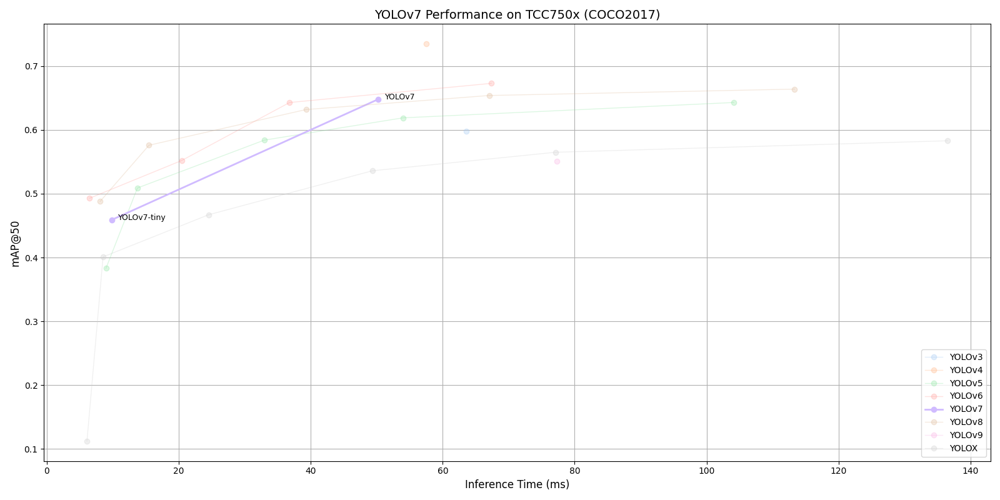

# YOLOv7 Benchmark on TCC750x

<table border="1" cellspacing="0" cellpadding="5">
    <thead>
        <tr>
            <th align="center" rowspan="2" colspan="2">Model</th>
            <th th align="center" rowspan="2">Framework</th>
            <th th align="center" rowspan="2">Dataset</th>
            <th th align="center" rowspan="2">Input Size (WxHxC)</th>
            <th align="center" rowspan="2">Inference Time (ms)</th>
            <th align="center" colspan="2">mAP@50:95</th>
            <th align="center" colspan="2">mAP@50</th>
            <th align="center" rowspan="2">Quantization Bit</th>
            <th align="center" colspan="2">Compiled Model Files</th>
            <th align="center" rowspan="2">References</th>
        </tr>
        <tr>
            <th>FP32</th>
            <th>INT8</th>
            <th>FP32</th>
            <th>INT8</th>
            <th>Weight and Bias Binary (MB)</th>
            <th>Command Binary (KB)</th>
        </tr>
    </thead>
    <tbody>
        <tr>
            <td align="center" rowspan="2" class="model">YOLOv7</td> <!-- Model -->
            <td align="center" class="variant">-</td>
            <td align="center">PyTorch</td> <!-- Framework -->
            <td align="center">COCO2017</td> <!-- Detections/DataSet -->
            <td align="center">640x640x3</td> <!-- Input Size (WxHxC) -->
            <td align="center">50.21</td>
            <td align="center">0.479</td>
            <td align="center">0.421</td>
            <td align="center">0.662</td>
            <td align="center">0.648</td>
            <td align="center">INT8 </td>
            <td align="center">36.11</td>
            <td align="center">242</td>
            <td align="center" rowspan="2"><a href="https://github.com/WongKinYiu/yolov7">GitHub<a></td> <!-- References: Link -->
        </tr>
        <tr>
            <td align="center" class="variant">tiny</td>
            <td align="center">PyTorch</td> <!-- Framework -->
            <td align="center">COCO2017</td> <!-- Detections/DataSet -->
            <td align="center">640x640x3</td> <!-- Input Size (WxHxC) -->
            <td align="center">9.84</td>
            <td align="center">0.154</td>
            <td align="center">0.136</td>
            <td align="center">0.488</td>
            <td align="center">0.459</td>
            <td align="center">INT8 </td>
            <td align="center">6.11</td>
            <td align="center">59</td>
        </tr>
    </tbody>
</table>
