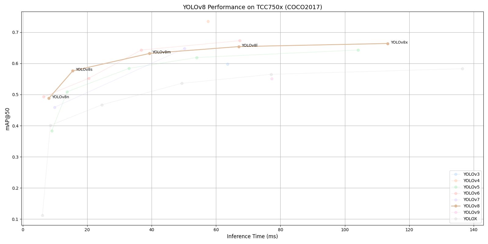

# YOLOv8 Benchmark on TCC750x

<table border="1" cellspacing="0" cellpadding="5">
    <thead>
        <tr>
            <th align="center" rowspan="2" colspan="2">Model</th>
            <th th align="center" rowspan="2">Framework</th>
            <th th align="center" rowspan="2">Dataset</th>
            <th th align="center" rowspan="2">Input Size (WxHxC)</th>
            <th align="center" rowspan="2">Inference Time (ms)</th>
            <th align="center" colspan="2">mAP@50:95</th>
            <th align="center" colspan="2">mAP@50</th>
            <th align="center" rowspan="2">Quantization Bit</th>
            <th align="center" colspan="2">Compiled Model Files</th>
            <th align="center" rowspan="2">References</th>
        </tr>
        <tr>
            <th>FP32</th>
            <th>INT8</th>
            <th>FP32</th>
            <th>INT8</th>
            <th>Weight and Bias Binary (MB)</th>
            <th>Command Binary (KB)</th>
        </tr>
    </thead>
    <tbody>
        <tr>
            <td align="center" rowspan="5" class="model">YOLOv8</td> <!-- Model -->
            <td align="center" class="variant">n</td>
            <td align="center">PyTorch</td> <!-- Framework -->
            <td align="center">COCO2017</td> <!-- Detections/DataSet -->
            <td align="center">640x640x3</td> <!-- Input Size (WxHxC) -->
            <td align="center">8.09</td>
            <td align="center">0.344</td>
            <td align="center">0.331</td>
            <td align="center">0.501</td>
            <td align="center">0.488</td>
            <td align="center">INT8 </td>
            <td align="center">3.15</td>
            <td align="center">70</td>
            <td align="center" rowspan="5"><a href="https://github.com/ultralytics/ultralytics">GitHub<a></td> <!-- References: Link -->
        </tr>
        <tr>
            <td align="center" class="variant">s</td> <!-- Model -->
            <td align="center">PyTorch</td> <!-- Framework -->
            <td align="center">COCO2017</td> <!-- Detections/DataSet -->
            <td align="center">640x640x3</td> <!-- Input Size (WxHxC) -->
            <td align="center">15.49</td>
            <td align="center">0.416</td>
            <td align="center">0.405</td>
            <td align="center">0.586</td>
            <td align="center">0.576</td>
            <td align="center">INT8 </td>
            <td align="center">10.93</td>
            <td align="center">91</td>
        </tr>
        <tr>
            <td align="center" class="variant">m</td> <!-- Model -->
            <td align="center">PyTorch</td> <!-- Framework -->
            <td align="center">COCO2017</td> <!-- Detections/DataSet -->
            <td align="center">640x640x3</td> <!-- Input Size (WxHxC) -->
            <td align="center">39.31</td>
            <td align="center">0.472</td>
            <td align="center">0.458</td>
            <td align="center">0.644</td>
            <td align="center">0.632</td>
            <td align="center">INT8 </td>
            <td align="center">25.39</td>
            <td align="center">153</td>
        </tr>
        <tr>
            <td align="center" class="variant">l</td> <!-- Model -->
            <td align="center">PyTorch</td> <!-- Framework -->
            <td align="center">COCO2017</td> <!-- Detections/DataSet -->
            <td align="center">640x640x3</td> <!-- Input Size (WxHxC) -->
            <td align="center">67.04</td>
            <td align="center">0.499</td>
            <td align="center">0.483</td>
            <td align="center">0.67</td>
            <td align="center">0.654</td>
            <td align="center">INT8 </td>
            <td align="center">42.72</td>
            <td align="center">245</td>
        </tr>
        <tr>
            <td align="center" class="variant">x</td> <!-- Model -->
            <td align="center">PyTorch</td> <!-- Framework -->
            <td align="center">COCO2017</td> <!-- Detections/DataSet -->
            <td align="center">640x640x3</td> <!-- Input Size (WxHxC) -->
            <td align="center">113.31</td>
            <td align="center">0.508</td>
            <td align="center">0.493</td>
            <td align="center">0.681</td>
            <td align="center">0.664</td>
            <td align="center">INT8 </td>
            <td align="center">66.85</td>
            <td align="center">434</td>
        </tr>
    </tbody>
</table>
