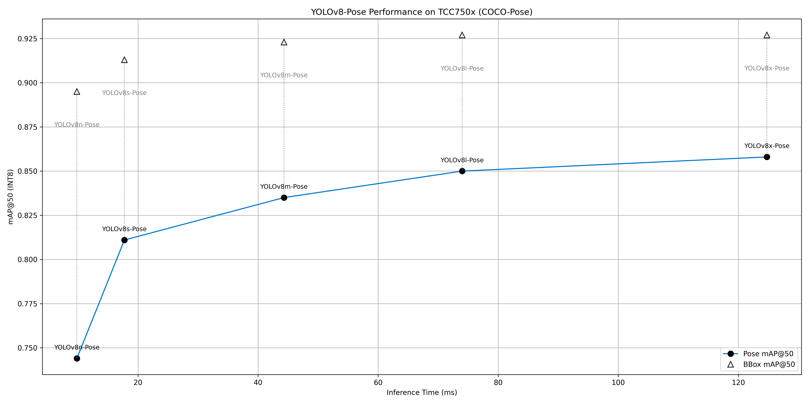

# YOLO-Pose Series Benchmark on TCC750x

The following table shows benchmark results for various YOLO-Pose models running on the TCC750x NPU.
You can compare the performance of each model.

YOLO-Pose extends the single-shot YOLO family to predict human keypoints in one pass. For each detected person, the model outputs x, y coordinates and a confidence per keypoint (COCO format typically uses 17 keypoints). This preserves YOLO’s hallmark of real-time speed while adding structured pose outputs useful for AR/VR, sports analytics, and robotics.

By convention, Ultralytics provides pretrained checkpoints with the “-pose” suffix (e.g., yolo11n-pose.pt, yolo11m-pose.pt, yolo11l-pose.pt). These are commonly trained/evaluated on  COCO2017 Keypoints using OKS-based AP/AR metrics for fair comparison across methods.

Click on the model name to download a tar file containing the model binary for TCC750x.

---

### 📊 Table Overview

| Column                    | Description                                                                 |
|--------------------------|-----------------------------------------------------------------------------|
| **Model**                | Name of the neural network model     |
| **Framework**            | Deep learning framework used (e.g., PyTorch\*, TFLite, ONNX)                 |
| **Dataset**              | Dataset used to benchmark model performance (e.g., COCO Keypoints 2017 (COCO-Pose) validation set with 2,346 images)                               |
| **Input Size (WxHxC)**   | Input Size (Width × Height × Channels) of the input image required by the model                            |
| **Inference Time (ms)**  | Inference time measured on the TCC750x EVB using zero-padded input images.                               |
| **BBox**             | Bounding box prediction Mean Average Precision (mAP), based on object detection performance                    |
| **Pose**             | Human keypoint estimation Mean Average Precision (mAP), evaluated using Object Keypoint Similarity (OKS) as defined in the COCO Keypoints benchmark                    |
| **Quantization Bit**     | Bit-depth used for quantization (e.g., INT8)                                |
| **Compiled Model Files**   | Sizes of the compiled model components: Weight and Bias Binary (.bin) and Command Binary (.bin) for execution on TCC750x    |
| **References**           | Link to the original repository of the model                         |

---
<table border="1" cellspacing="0" cellpadding="5">
    <thead>
        <tr>
            <th rowspan="2" colspan="2">Model</th>
            <th rowspan="2">Framework</th>
            <th rowspan="2">Dataset</th>
            <th rowspan="2">Input Size (WxHxC)</th>
            <th rowspan="2">Inference Time (ms)</th>
            <th colspan="2">BBox mAP@50:95</th>
            <th colspan="2">Pose mAP@50:95</th>
            <th colspan="2">BBox mAP@50</th>
            <th colspan="2">Pose mAP@50</th>
            <th rowspan="2">Quantization Bit</th>
            <th colspan="2">Compiled Model Files</th>
            <th colspan="2">References</th>
        </tr>
        <tr>
            <th>FP32</th>
            <th>INT8</th>
            <th>FP32</th>
            <th>INT8</th>
            <th>FP32</th>
            <th>INT8</th>
            <th>FP32</th>
            <th>INT8</th>
            <th>Weight and Bias Binary (MB)</th>
            <th>Command Binary (KB)</th>
            <th>Link</th>
            <th>License</th>
        </tr>
    </thead>
        <tbody>
            <tr>
                <td align="center" rowspan="5" class="model"><a href="#">YOLOv8-Pose</a></td>
                <td align="center" class="variant" rowspan="1"><a href="yolov8-pose/yolov8n-pose">n</a></td> <!-- Models: Variant -->
                <td align="center">PyTorch</td> <!-- Framework -->
                <td align="center">COCO-Pose</td>
                <td align="center">640x640x3</td> <!-- Input Size (WxHxC) -->
                <td align="right">9.82</td> <!-- Inference Time (msec): EVB -->
                <td align="right">0.680</td>
                <td align="right">0.675</td>
                <td align="right">0.480</td>
                <td align="right">0.429</td>
                <td align="right">0.898</td>
                <td align="right">0.895</td>
                <td align="right">0.764</td>
                <td align="right">0.744</td>
                <td align="center">INT8</td>
                <td align="right">3.2</td>
                <td align="right">98</td>
                <td align="center" rowspan="5"><a href="https://github.com/ultralytics/ultralytics">GitHub<a></td> <!-- References: Link -->
                <td align="center" rowspan="5">AGPL-3.0</td>
            </tr>
            <tr>
                <td align="center" class="variant" rowspan="1"><a href="yolov8-pose/yolov8s-pose">s</a></td> <!-- Models: Variant -->
                <td align="center">PyTorch</td> <!-- Framework -->
                <td align="center">COCO-Pose</td>
                <td align="center">640x640x3</td> <!-- Input Size (WxHxC) -->
                <td align="right">17.74</td> <!-- Inference Time (msec): EVB -->
                <td align="right">0.716</td>
                <td align="right">0.709</td>
                <td align="right">0.572</td>
                <td align="right">0.516</td>
                <td align="right">0.915</td>
                <td align="right">0.913</td>
                <td align="right">0.824</td>
                <td align="right">0.811</td>
                <td align="center">INT8</td>
                <td align="right">11.1</td>
                <td align="right">116</td>
            </tr>
            <tr>
                <td align="center" class="variant" rowspan="1"><a href="yolov8-pose/yolov8m-pose">m</a></td> <!-- Models: Variant -->
                <td align="center">PyTorch</td> <!-- Framework -->
                <td align="center">COCO-Pose</td>
                <td align="center">640x640x3</td> <!-- Input Size (WxHxC) -->
                <td align="right">44.31</td> <!-- Inference Time (msec): EVB -->
                <td align="right">0.741</td>
                <td align="right">0.735</td>
                <td align="right">0.620</td>
                <td align="right">0.558</td>
                <td align="right">0.924</td>
                <td align="right">0.923</td>
                <td align="right">0.850</td>
                <td align="right">0.835</td>
                <td align="center">INT8</td>
                <td align="right">25.3</td>
                <td align="right">207</td>
            </tr>
            <tr>
                <td align="center" class="variant" rowspan="1"><a href="yolov8-pose/yolov8l-pose">l</a></td> <!-- Models: Variant -->
                <td align="center">PyTorch</td> <!-- Framework -->
                <td align="center">COCO-Pose</td>
                <td align="center">640x640x3</td> <!-- Input Size (WxHxC) -->
                <td align="right">73.99</td> <!-- Inference Time (msec): EVB -->
                <td align="right">0.750</td>
                <td align="right">0.742</td>
                <td align="right">0.645</td>
                <td align="right">0.594</td>
                <td align="right">0.929</td>
                <td align="right">0.927</td>
                <td align="right">0.860</td>
                <td align="right">0.850</td>
                <td align="center">INT8</td>
                <td align="right">42.5</td>
                <td align="right">297</td>
            </tr>
            <tr>
                <td align="center" class="variant" rowspan="1"><a href="yolov8-pose/yolov8x-pose">x</a></td> <!-- Models: Variant -->
                <td align="center">PyTorch</td> <!-- Framework -->
                <td align="center">COCO-Pose</td>
                <td align="center">640x640x3</td> <!-- Input Size (WxHxC) -->
                <td align="right">124.76</td> <!-- Inference Time (msec): EVB -->
                <td align="right">0.753</td>
                <td align="right">0.745</td>
                <td align="right">0.659</td>
                <td align="right">0.615</td>
                <td align="right">0.928</td>
                <td align="right">0.927</td>
                <td align="right">0.866</td>
                <td align="right">0.858</td>
                <td align="center">INT8</td>
                <td align="right">66.5</td>
                <td align="right">534</td>
            </tr>
        <tbody>
    <tbody>
        <tr>
        </tr>
    </tbody>
</table>

- - -
## 📤 Output Format
- The raw output of a YOLO pose estimation model is a tensor (or multiple tensors) containing a dense grid of predictions across different spatial locations and anchor boxes.
- These raw outputs undergo post-processing, which includes:
  - Applying sigmoid/softmax activations to normalize outputs
  - Filtering predictions based on confidence thresholds
  - Applying Non-maximum Suppression (NMS) to remove overlapping detections
  - Generating segmentation masks for each detected object

- The final post-processed output includes a list of detected objects, each containing:
  - Confidence score
  - Bounding box coordinates (x_min, y_min, x_max, and y_max)
  - Keypoints: an array of length 17, where each entry is x,y,keypoint_confidence for a specific joint (e.g., nose, eyes, shoulders, …)

### Footnote
* PyTorch* models are converted to ONNX for deployment.

