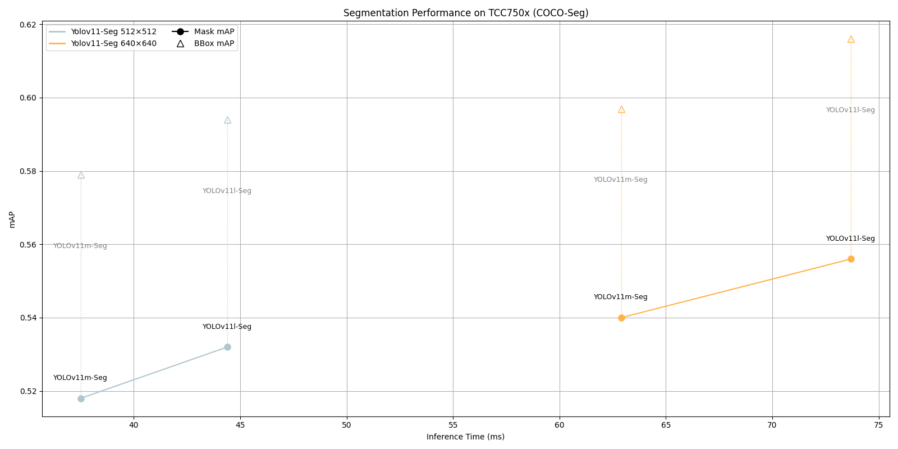

# Segmentation Benchmark on TCC750x
The following table shows benchmark results for various segmentation models running on the TCC750x NPU.  
You can compare the performance of each model.  
  
Click on the model name to download a tar file containing the model binary for TCC750x.
- - -

### 📊 Table Overview

| Column                    | Description                                                                 |
|--------------------------|-----------------------------------------------------------------------------|
| **Model**                | Name of the neural network model     |
| **Framework**            | Deep learning framework used (e.g., PyTorch\*, TFLite, ONNX)                |
| **Dataset**              | Dataset used to benchmark model performance  |
| **Input Size (WxHxC)**   | Input Size (Width × Height × Channels) and dimensions of the input image required by the model                            |
| **Inference Time (ms)**  | Inference time measured on the TCC750x EVB using zero-padded input images                |
| **BBox**             | Bounding box prediction Mean Average Precision (mAP), based on object detection performance                    |
| **Mask**             | Instance segmentation mask Mean Average Precision (mAP), based on segmentation quality                    |
| **Quantization Bit**     | Bit-depth used for quantization (e.g., INT8)                                |
| **Compiled Model Files**   | Sizes of the compiled model components: Weight and Bias Binary (.bin) and Command Binary (.bin) for execution on TCC750x                    |
| **References**           | Link to the original repository of the model      

- - -

<table border="1" cellspacing="0" cellpadding="5">
    <thead>
        <tr>
            <th rowspan="2" colspan="2">Model</th>
            <th rowspan="2">Framework</th>
            <th rowspan="2">Dataset</th>
            <th rowspan="2">Input Size (WxHxC)</th>
            <th rowspan="2">Inference Time (ms)</th>
            <th colspan="2">BBox mAP@50</th>
            <th colspan="2">Mask mAP@50</th>
            <th rowspan="2">Quantization Bit</th>
            <th colspan="2">Compiled Model Files</th>
            <th rowspan="2">References</th>
        </tr>
        <tr>
            <th>FP32</th>
            <th>INT8</th>
            <th>FP32</th>
            <th>INT8</th>
            <th>Weight and Bias Binary (MB)</th>
            <th>Command Binary (KB)</th>
        </tr>
    </thead>
    <tbody>
        <tr>
            <td align="center" rowspan="4" class="model"><a href="YOLO-Seg/yolov11-seg">YOLOv11-Seg**</a></td>
            <td align="center" class="variant" rowspan="2"><a href="YOLO-Seg/yolov11-seg/yolov11m-seg/">m</a></td> <!-- Models: Variant -->
            <td align="center">PyTorch</td> <!-- Framework -->
            <td align="center">COCO-Seg</td>
            <td align="center">512x512x3</td> <!-- Input Size (WxHxC) -->
            <td align="center">37.5</td> <!-- Inference Time (msec): EVB -->
            <td align="center">0.589</td>
            <td align="center">0.579</td>
            <td align="center">0.526</td>
            <td align="center">0.518</td>
            <td align="center">INT8</td>
            <td align="center">21.19</td>
            <td align="center">201</td>
            <td align="center" rowspan="4"><a href="https://docs.ultralytics.com/tasks/segment/">GitHub<a></td> <!-- References: Link -->
        </tr>
        <tr>
            <td align="center">PyTorch</td> <!-- Framework -->
            <td align="center">COCO-Seg</td>
            <td align="center">640x640x3</td> <!-- Input Size (WxHxC) -->
            <td align="center">62.9</td> <!-- Inference Time (msec): EVB -->
            <td align="center">0.611</td>
            <td align="center">0.597</td>
            <td align="center">0.554</td>
            <td align="center">0.54</td>
            <td align="center">INT8</td>
            <td align="center">21.19</td>
            <td align="center">311</td>
        </tr>
        <tr>
            <td align="center" class="variant" rowspan="2"><a href="YOLO-Seg/yolov11-seg/yolov11l-seg/">l<a></td> <!-- Models: Variant -->
            <td align="center">PyTorch</td> <!-- Framework -->
            <td align="center">COCO-Seg</td>
            <td align="center">512x512x3</td> <!-- Input Size (WxHxC) -->
            <td align="center">44.4</td> <!-- Inference Time (msec): EVB -->
            <td align="center">0.604</td>
            <td align="center">0.594</td>
            <td align="center">0.542</td>
            <td align="center">0.532</td>
            <td align="center">INT8</td>
            <td align="center">26.02</td>
            <td align="center">231</td>
        </tr>
        <tr>
            <td align="center">PyTorch</td> <!-- Framework -->
            <td align="center">COCO-Seg</td>
            <td align="center">640x640x3</td> <!-- Input Size (WxHxC) -->
            <td align="center">73.7</td> <!-- Inference Time (msec): EVB -->
            <td align="center">0.63</td>
            <td align="center">0.616</td>
            <td align="center">0.569</td>
            <td align="center">0.556</td>
            <td align="center">INT8</td>
            <td align="center">26.02</td>
            <td align="center">352</td>
        </tr>
    </tbody>
</table>

- - -

### Footnote                
* PyTorch* models are converted to ONNX for deployment.

* YOLOv11-Seg** is a custom-modified version based on a reference YOLO model. Specifically, the C2PSA layers in the backbone have been replaced with Squeeze-and-Excitation (SE) modules to better suit the TCC750x NPU.
